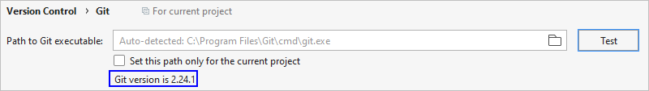
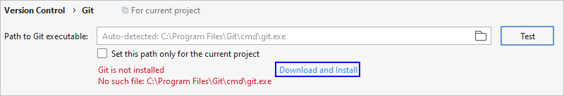
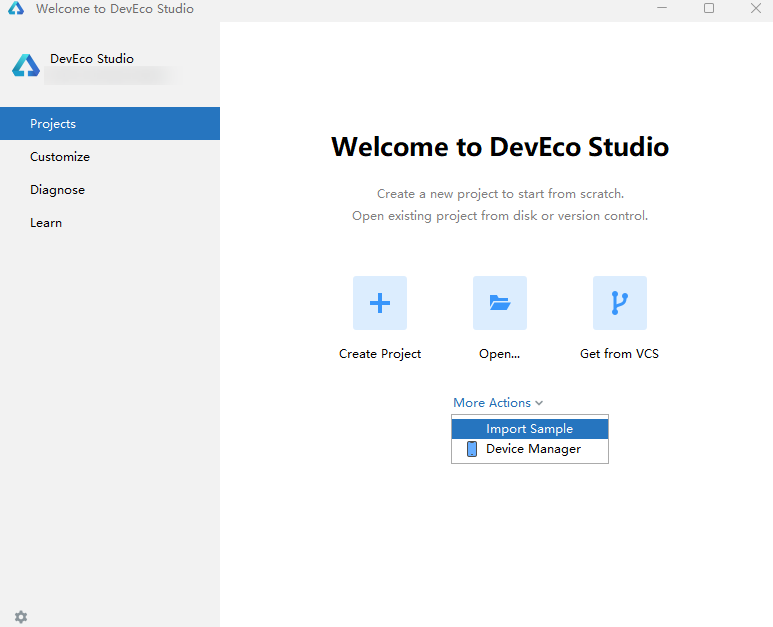
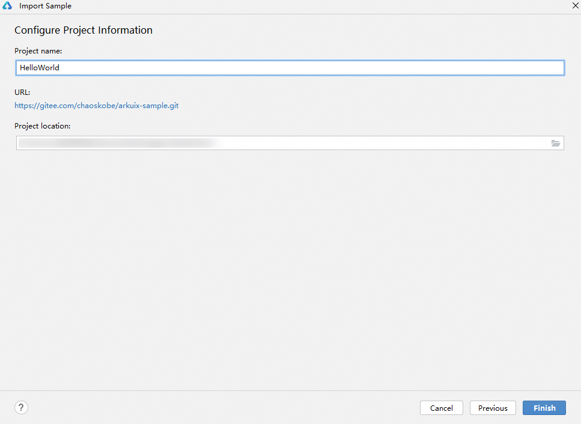

# 导入Sample工程

DevEco Studio支持Sample工程的导入功能，通过对接Gitee开源社区中的Sample资源，可一键导入Sample工程到DevEco Studio中。下面介绍导入Sample的方法。

## 约束与限制

### 支持的国家/地区

该功能仅支持中国境内（香港特别行政区、澳门特别行政区、中国台湾除外）。

## 操作步骤

1. 在DevEco Studio的欢迎页，进入****Customize**** ****> All Settings... > Version Control > Git****界面，单击****Test****按钮检测是否安装Git工具。

    

   在打开工程的情况下，可以单击****File > Settings****（macOS为****DevEco Studio > Preferences/Settings****）进入设置界面。

   - 已安装，请根据[2](#li1599692216194)开始导入Sample。

     
   - 未安装，请单击****Download and Install****，DevEco Studio会自动下载并安装。安装完成后，请根据[2](#li1599692216194)开始导入Sample。

     
2. 在DevEco Studio的欢迎页，在****Projects****页签下，单击****M********ore Action >**** ****Import Sample****按钮，导入Sample工程。

    

   在打开工程的情况下，可以单击****File > New > Import > Import Sample****来进行导入。

   
3. 选择需要导入的Sample工程，然后单击****Next****。
4. 设置****Project name****和****Project location****，然后单击****Finish****，等待Sample工程导入完成。

   
5. 导入Sample后，等待工程同步完成即可。

    

   如果网络受限，导入时会提示“Failed to connect to gitee.com port 443: Time out”连接超时错误，请[配置Git代理信息](https://developer.huawei.com/consumer/cn/doc/harmonyos-faqs/faqs-development-environment-2)。
