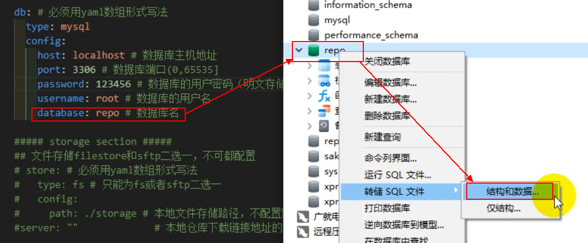
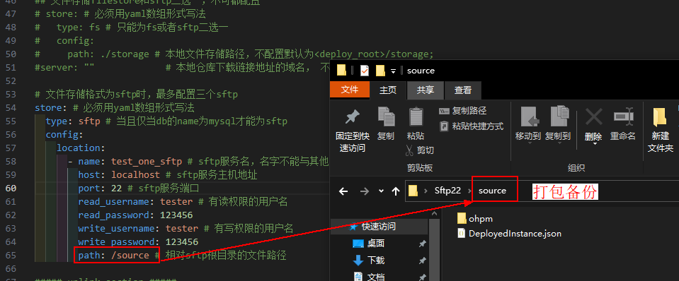

# 数据备份

数据迁移或者版本升级之前请务必进行数据备份，以免重要数据丢失，无法回滚。备份的内容包括****ohpm-repo****中****&lt;deploy\_root****&gt;部署根目录内的数据、db元数据以及store三方包数据。

## 备份deploy\_root部署根目录

 

&lt;deploy\_root&gt;：ohpm-repo部署根目录，默认的路径为：

windows系统：~/AppData/Roaming/Huawei/ohpm-repo

其他操作系统：~/ohpm-repo

ohpm-repo在版本1.1.0之前不支持配置&lt;deploy\_root&gt;，都采用默认值，若您的ohpm-repo支持且配置了&lt;deploy\_root&gt;，请找到对应目录，并使用常用的压缩工具打包备份该目录。

 

如果配置文件中db，storage，logs和uplink的存储路径可配置，且存储位置不在ohpm-repo部署根目录&lt;deploy\_root&gt;中，请找到对应目录进行数据备份。

## 备份<包存储目录>和&lt;mysql&gt;

 

如果您使用的是本地存储（配置文件中db为filedb本地存储，store为fs本地存储），在备份&lt;deploy\_root&gt;时已经完成db和store的备份，请忽略该步骤。

- 如果您的配置项db使用了mysql存储，请根据配置的数据库名，备份结构和数据。

  

- 如果您的配置项store使用了Sftp存储或自定义存储插件存储，请根据配置的存储目录，进行备份（图片以sftp存储举例）

  
