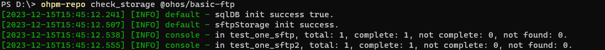

# ohpm-repo check\_storage

检查sftp中存储包的完整性。

## 前提条件

- 已成功执行[start 命令](/ide-project/ide-module-management/ide-ohpm-repo/ide-ohpm-repo-command/ide-ohpm-repo-start)或者[restart 命令](/ide-project/ide-module-management/ide-ohpm-repo/ide-ohpm-repo-command/ide-ohpm-repo-restart)，ohpm-repo服务启动成功。
- 数据存储db模块的类型必须为mysql，文件存储store模块的类型必须为sftp。

## 命令格式

```
ohpm-repo check_storage <target> [options]
```

## 功能描述

命令根据元数据检查sftp存储的包是否存在且完整。该命令要求数据存储db模块必须使用mysql，文件存储store模块必须使用sftp。

## 参数

### &lt;target&gt;

- 类型：String
- 必填参数
- 格式： [<@scope>/]&lt;pkg&gt;[<@version>]或@all
- 说明： <@scope>和<@version>是可选的，&lt;pkg&gt;是包名。

必须在check\_storage命令后面配置&lt;target&gt;参数，指定要检查的包或者用@all指定检查所有包。

## 选项

### failed

- 默认值：无
- 类型：无

可以在check\_storage命令后面配置--failed选项 ，则只检查在下载错误日志中未被处理的且满足&lt;target&gt;条件的包。

## 示例

执行以下命令，检查包@ohos/basic-ftp的完整性：

```
ohpm-repo check_storage @ohos/basic-ftp
```

 

检查@ohos/basic-ftp包在所有sftp存储目录中的完整性。

结果示例：


