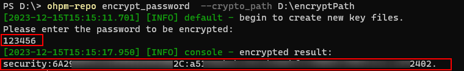

# ohpm-repo encrypt\_password

对键入的密码类型字符串进行加密。

## 命令格式

```
ohpm-repo encrypt_password [options]
```

## 功能描述

使用指定的加密组件加密从标准输入读取的数据，并在标准输出中输出密文。

## 选项

### crypto\_path

- 类型：String
- 必填参数

必须在encrypt\_password命令后面配置--crypto\_path &lt;string&gt;参数，指定加密组件的路径。如果是完整组件，将用该组件对键入的密码内容进行加密。如果是一个空目录，则命令将生成新的加密组件并对键入的密码内容进行加密。

## 示例

执行以下命令：

```
ohpm-repo encrypt_password --crypto_path D:\encryptPath
```

结果示例：


