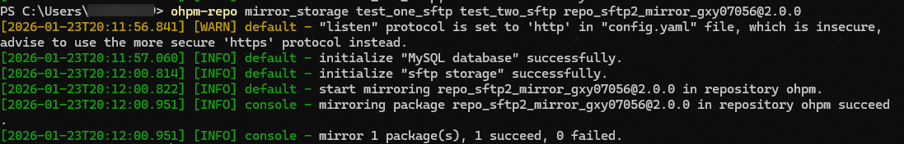

# ohpm-repo mirror\_storage

同步sftp存储的包。

## 前提条件

- 已成功执行[start 命令](/ide-project/ide-module-management/ide-ohpm-repo/ide-ohpm-repo-command/ide-ohpm-repo-start)或者[restart 命令](/ide-project/ide-module-management/ide-ohpm-repo/ide-ohpm-repo-command/ide-ohpm-repo-restart)，ohpm-repo服务启动成功。
- 数据存储db模块的类型必须为mysql，文件存储store模块的类型必须为sftp。

## 命令格式

```
ohpm-repo mirror_storage <source_sftp> <target_sftp> <target> [options]
```

## 功能描述

该命令必须配置文件存储插件模块为sftp。命令会将****源sftp****目录下满足&lt;target&gt;条件的包同步到****目标sftp****目录下。

## 参数

### <source\_sftp>

- 类型：String
- 必填参数

必须在mirror\_storage命令后面配置<source\_sftp>参数，指定****源sftp****配置的名字。

### &lt;target\_sftp&gt;

- 类型：String
- 必填参数

必须在mirror\_storage命令后面配置&lt;target\_sftp&gt;参数，指定****目标sftp****配置的名字。

### &lt;target&gt;

- 类型：String
- 必填参数
- 格式： [<@scope>/]&lt;pkg&gt;[<@version>] 或 @all
- 说明： <@scope>和<@version>是可选的， &lt;pkg&gt;是包名。

必须在mirror\_storage命令后配置&lt;target&gt;参数，指定满足条件的包；或使用@all指定所有包。

## 选项

### failed

- 默认值：无
- 类型：无

可以在mirror\_storage命令后面配置--failed选项，则只同步在下载错误日志中未被处理的且满足&lt;target&gt;条件的包，如果同步成功，则相应的错误日志会被设置成handled。

## 示例

执行以下命令，同步包repo\_sftp2\_mirror\_gxy07056@2.0.0：

```
ohpm-repo mirror_storage test_one_sftp test_two_sftp repo_sftp2_mirror_gxy07056@2.0.0
```

说明：将名为test\_one\_sftp的sftp目录中repo\_sftp2\_mirror\_gxy07056@2.0.0包同步到名为test\_two\_sftp的sftp目录中。

结果示例：


