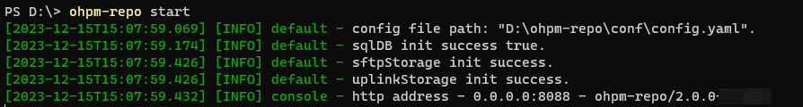

# ohpm-repo start

启动ohpm-repo服务。

## 前提条件

已成功执行[install命令](/ide-project/ide-module-management/ide-ohpm-repo/ide-ohpm-repo-command/ide-ohpm-repo-install)，并按要求刷新环境变量。

## 命令格式

```
ohpm-repo start
```

## 功能描述

用于启动ohpm-repo服务，创建一个ohpm-repo实例。

 

启动时将ohpm-repo服务的pid存放到&lt;deploy\_root&gt;/runtime/.pid文件中，其中&lt;deploy\_root&gt;为[ohpm-repo私仓部署目录](/ide-project/ide-module-management/ide-ohpm-repo/ide-ohpm-repo-configuration#zh-cn_topic_0000001745376470_关于-deploy_root)。

## 示例

执行以下命令：

```
ohpm-repo start
```

结果示例：


