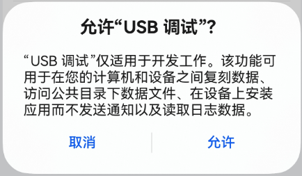
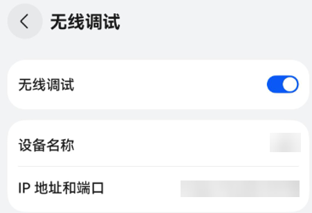
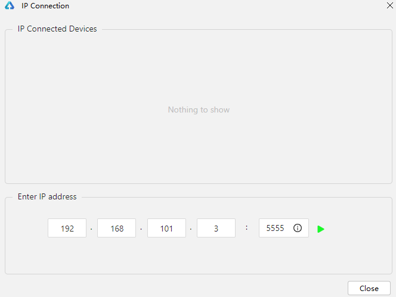
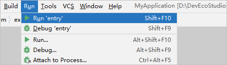

# 使用本地真机运行应用

在本地真机中运行HarmonyOS应用/元服务，可以采用USB连接方式或者无线连接方式。

 

Wearable设备仅支持无线连接方式（Lite Wearable设备不支持）。

## 前提条件

- 确保设备系统版本升级到[HarmonyOS NEXT Developer Beta1](https://developer.huawei.com/consumer/cn/doc/harmonyos-releases/overview-500#section849861583816)或以上。
- 在真机设备上查看****设置 > 系统****中开发者选项是否存在，如果不存在，可在****设置 > **具体的设备名称******中，连续七次单击****软件版本****，直到提示“开启开发者选项”，点击****确认开启****后输入PIN码（如果已设置），设备将自动重启，请等待设备完成重启。
- 在设备运行应用/元服务需要根据[配置调试签名](/ide-signing)章节，提前对应用/元服务进行签名。

## 使用USB连接方式

1. 使用USB方式，将真机设备与PC端进行连接。
2. 在****设置 > 系统 > 开发者选项****中，打开****USB调试****开关（确保设备已连接USB）。
3. 在真机设备中会弹出“允许USB调试”的弹框，单击****允许****。

   
4. 在菜单栏中，单击****Run>Run'模块名称'****或，或使用默认快捷键****Shift+F10****（macOS为****Control+R****）运行应用/元服务。

   
5. DevEco Studio启动HAP的编译构建和安装。安装成功后，设备会自动运行安装的HarmonyOS应用/元服务。

### 使用设备连接助手排查问题

从DevEco Studio 5.1.1 Beta1版本开始，设备连接后，如果DevEco Studio无法识别到设备，显示“No Devices”，可使用设备连接助手来排查问题。点击设备下拉框，并点击****Troubleshoot Device Connections****打开该功能，分为三个步骤，每个步骤排查完后点击****Next****排查下一个。

1. ****通过USB连接设备：****根据界面提示，使用USB连接设备后，点击****Rescan Devices****按钮，扫描已连接的设备，确保扫描结果中包含待调试的设备。
2. ****启用USB调试：****根据界面提示，确保设备系统版本正确，并且启用开发者选项和USB调试。
3. ****重启HDC服务：****如果DevEco Studio仍然无法识别设备，点击****Restart hdc Service****按钮重启HDC服务，重启后HDC会重新识别设备。如果重启后仍识别不到设备，请参考[设备连接后，无法识别设备的处理指导](https://developer.huawei.com/consumer/cn/doc/harmonyos-faqs/faqs-app-debugging-3)或[如何解决设备无法识别问题](https://developer.huawei.com/consumer/cn/doc/harmonyos-faqs/faqs-performance-analysis-kit-32)。

## 使用无线连接方式

1. 将真机设备和PC连接到同一WLAN网络。
2. 在****设置 > 系统 >**** ****开发者选项****中，打开****无线调试****或****通过WLAN调试****（Wearable设备）开关，并获取设备端的IP地址和端口号。

   
3. 连接设备，有两种方式。
   - 在DevEco Studio菜单栏中，单击****Tools > IP Connection****，输入连接设备的IP地址和端口号，单击，连接正常后，设备状态为****online****。

     
   - 执行hdc命令，关于hdc工具的使用指导请参考[hdc](/system-debug-optimize/debugging-commands/hdc)。

     ```
     hdc tconn 设备IP地址:端口号
     ```
4. 在菜单栏中，单击****Run>Run'模块名称'****或，或使用默认快捷键****Shift+F10****（macOS为****Control+R****）运行应用/元服务。

   
5. DevEco Studio启动HAP的编译构建和安装。安装成功后，设备会自动运行安装的HarmonyOS应用/元服务。
