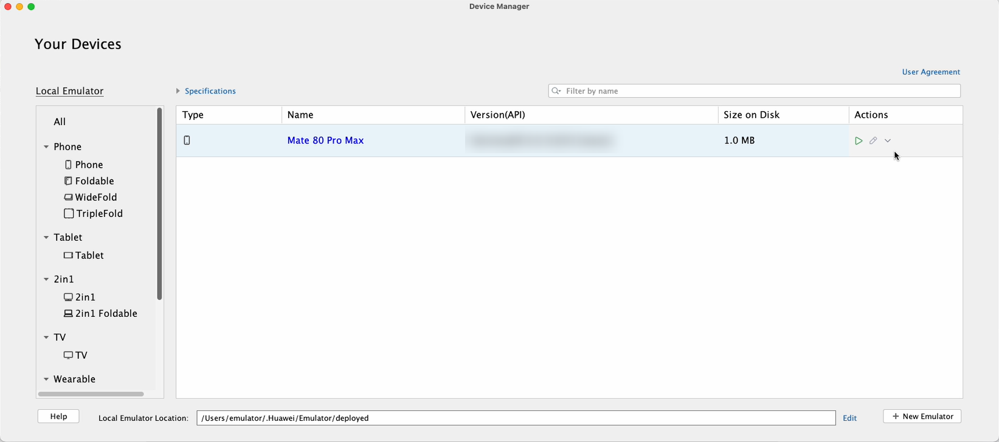
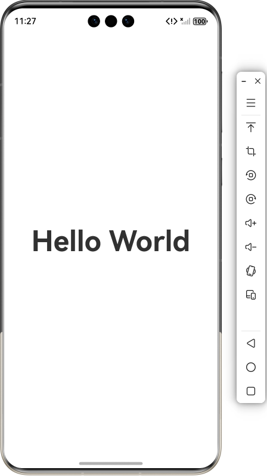
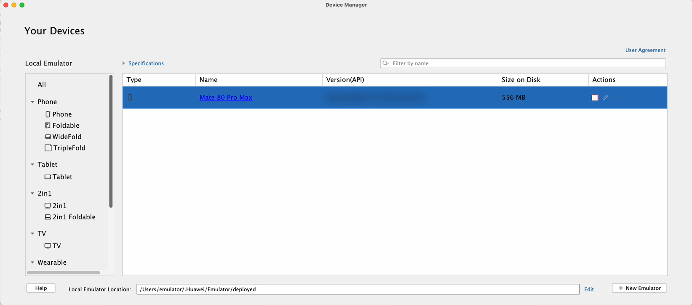

# 启动和关闭模拟器

在设备管理器页面，单击即可启动模拟器。模拟器启动时会默认携带之前运行时的用户数据，包括用户上传的文件，安装的应用等。如果是新创建的模拟器，则不会携带用户数据。如果想清除之前运行时的用户数据，点击****Actions >****  ****> Wipe User Data****。

从DevEco Studio 6.1.0 Beta1版本开始，如果创建模拟器时选择热启动，则启动模拟器时会加载上次关闭时保存的快照，启动后会恢复至上次关闭时的状态。热启动后，多屏状态会恢复为单屏状态，折叠屏模拟器会恢复成默认展开状态。

如果热启动后出现异常，可点击****Actions >****  ****> Wipe User Data****清除用户数据后重新启动。

例如推包运行后关闭模拟器，再次启动时会显示在上次运行的界面。

在模拟器运行期间，可以点击****Actions >****  ****> Show on Disk****显示模拟器在本地生成的用户数据。点击****Actions >****  ****> Generate logs****可以生成模拟器自启动到此刻的所有日志信息。想要关闭运行中的模拟器，可以在设备管理器页面点击，或者点击模拟器工具栏上的关闭按钮。

模拟器关闭后，点击****Actions >****  ****> Delete****可以删除模拟器，并清除模拟器的用户数据和配置信息。
