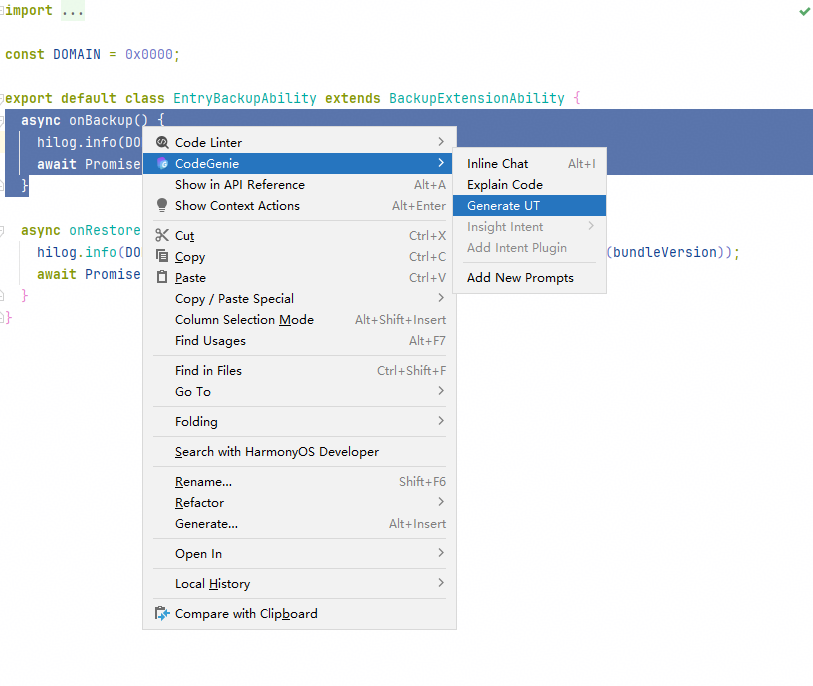
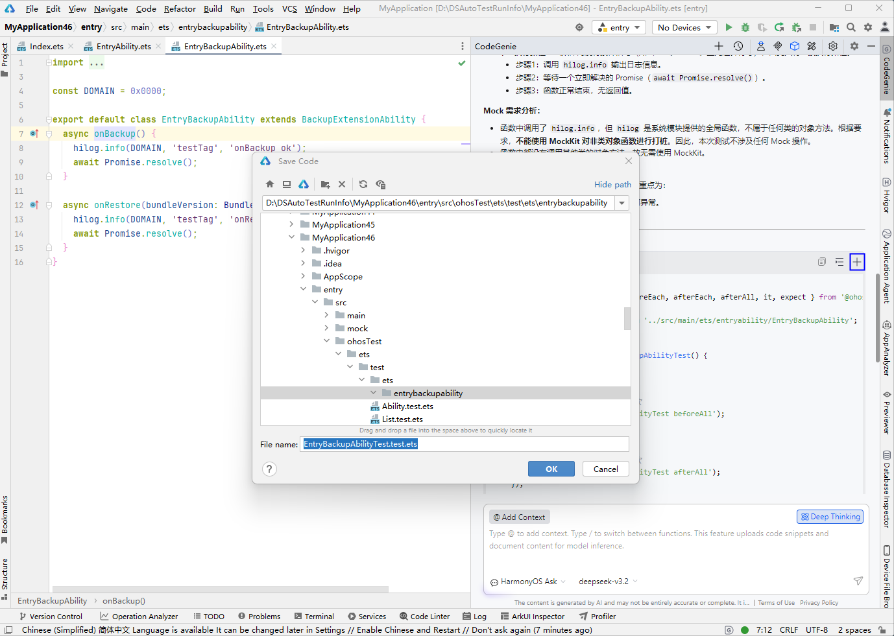
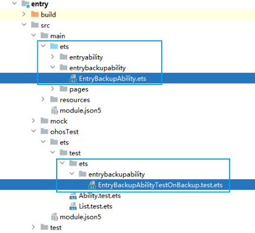

# 单元测试用例生成

根据选中的ArkTS方法名称，CodeGenie支持自动生成对应单元测试用例，提升测试覆盖率。

## 使用约束

- 该功能最多支持解读30000字符以内的代码片段。
- ArkUI代码、生命周期函数、@Extend/@Styles/@Builder修饰的函数、private修饰的私有函数不支持生成单元测试用例。
- 单元测试用例生成时使用HarmonyOS Ask智能体。

## 操作步骤

1. 点击页面右侧菜单栏CodeGenie图标，完成登录后，在ArkTS文档中，光标放置于方法名称上或框选完整的待测试方法代码块，右键选择****CodeGenie > Generate UT****，开始生成单元测试用例。

   
2. 在问答对话区生成单元测试用例后，点击Code Genie问答区中可复制生成的代码，点击将生成的代码插入到代码文件，点击弹出文件另存为框，填写文件名称后点击****OK****按钮保存。

   
3. 生成的单元测试用例文件被保存在待测函数所在模块下的****ohosTest/ets/test****目录，目录结构和待测函数保持一致。

   
4. 运行单元测试用例，具体请参考[运行测试用例](/ide-app-test/ide-test/ide-code-test/ide-instrument-test#section14415226122419)。
