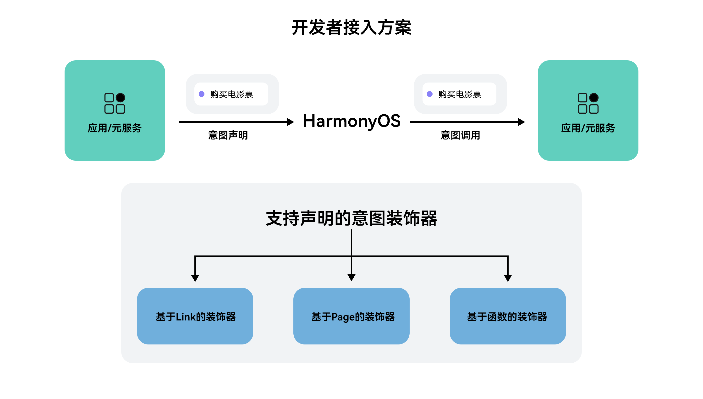

# 方案概述

从6.0.0(20)开始，支持通过装饰器开发意图，支持将现有功能通过装饰器快速集成至系统入口。开发者可自定义意图，通过添加装饰器方式实现意图快速接入，支持Link跳转、Page和函数等意图装饰器，方便开发者快速开放应用内功能。

开发者可根据想要暴露的应用功能，选择不同类型的装饰器进行意图声明：

- [基于Link的装饰器：@InsightIntentLink](/intents-kit-guide/intents-skill-all-rec/intents-skill-all-rec-access-programme/intents-skill-all-rec-decorator/intents-skill-all-rec-decorator-link)

  在开发者已实现的DeepLink，AppLink上添加装饰器，实现功能页面的拉起。

  约束：仅支持前台执行。
- [基于Page的装饰器：@InsightIntentPage](/intents-kit-guide/intents-skill-all-rec/intents-skill-all-rec-access-programme/intents-skill-all-rec-decorator/intents-skill-all-rec-decorator-page)

  在开发者已实现的Page上添加装饰器，实现功能页面的拉起。

  约束：仅支持前台执行，仅支持Navigation架构。
- [基于函数的装饰器：@InsightIntentFunction和@InsightIntentFunctionMethod](/intents-kit-guide/intents-skill-all-rec/intents-skill-all-rec-access-programme/intents-skill-all-rec-decorator/intents-skill-all-rec-decorator-function)

  在目标执行函数上添加@InsightIntentFunctionMethod装饰器，以及在目标执行函数所属Class上添加@InsightIntentFunction进行意图声明，实现目标函数的执行。

  约束：仅支持后台执行。
