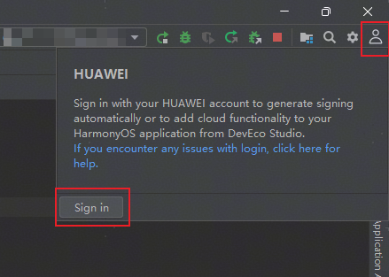
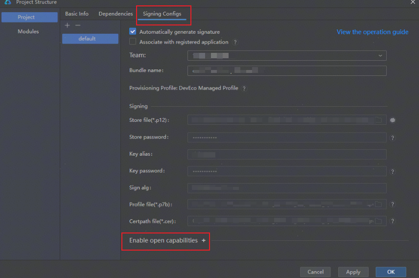
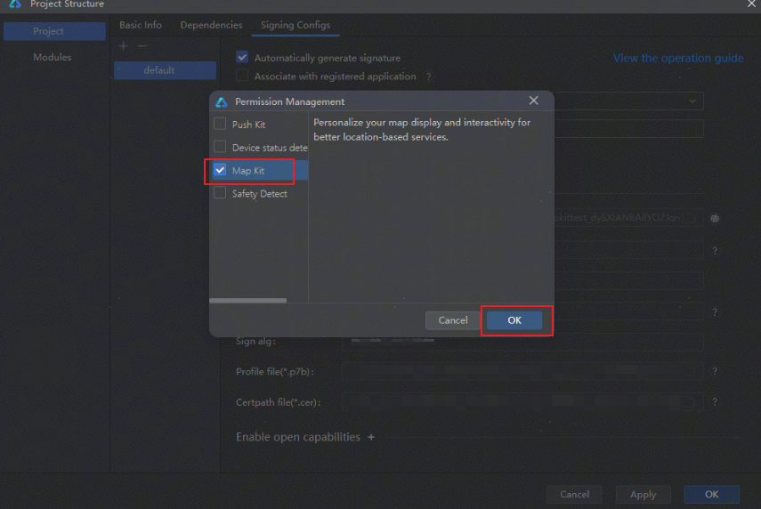
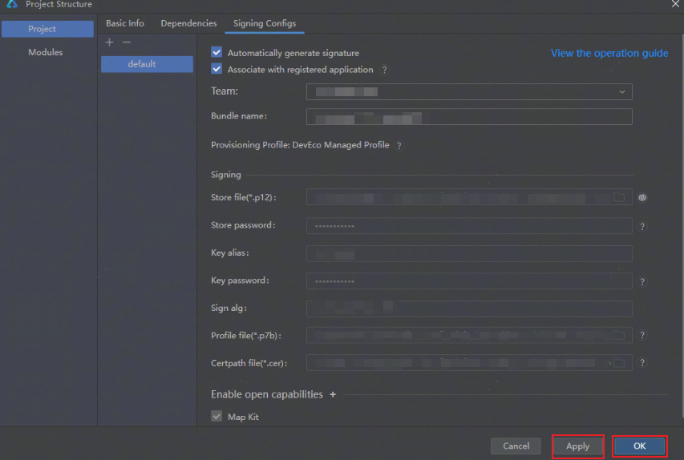

# 开发准备

请优先[开通地图服务](#开通地图服务)后，再参考“[应用开发准备](/application-dev-overview)”完成基本准备工作，然后再继续进行以下开发活动。

 

- 从HarmonyOS 5.0.2(14)版本开始，开发者无需配置公钥指纹和Client ID。
- 从DevEco Studio 6.0.0 Beta5版本开始，支持在DevEco Studio中开通地图服务。

## 开通地图服务

Map Kit提供2种方式开通地图服务：

- 通过DevEco Studio开通地图服务。
- 通过AppGallery Connect网站开通地图服务。

方式一：通过DevEco Studio开通地图服务

1. 登录DevEco Studio应用。

   
2. 选择文件，点击项目结构。

   
3. 进入“Signing Configs”页面，点击“Enable open capabilities”。

   
4. 勾选“Map Kit”选项，点击“OK”。

   
5. 选择“Apply”应用地图服务配置，点击“OK”完成地图服务配置。

   

方式二：通过AppGallery Connect网站开通地图服务。

1. 登录[AppGallery Connect](https://developer.huawei.com/consumer/cn/service/josp/agc/index.html)网站，选择“开发与服务”。

   
2. 在项目列表中找到您的项目，在项目下的应用列表中选择需要打开“地图服务”的应用。

   
3. 选择开放能力管理，找到“地图服务”开关，打开开关。

   
4. 确认已经开启“地图服务”开放能力，并完成签名。

   - 调试阶段必须[申请调试证书](https://developer.huawei.com/consumer/cn/doc/app/agc-help-add-debugcert-0000001914263178)、[注册设备](https://developer.huawei.com/consumer/cn/doc/app/agc-help-add-device-0000002283189937)、开启"地图服务"后重新[申请调试Profile文件](https://developer.huawei.com/consumer/cn/doc/app/agc-help-debug-profile-0000002248181278)，并完成[手动签名](/ide-signing#section297715173233)。
   - 发布阶段必须[申请发布证书](https://developer.huawei.com/consumer/cn/doc/app/agc-help-release-cert-0000002283336729)、开启“地图服务”后重新[申请发布Profile](https://developer.huawei.com/consumer/cn/doc/app/agc-help-release-profile-0000002248341090)文件，并[配置签名信息](/ide-publish-app#section280162182818)。

      

     若使用原有的Profile文件，请确保在申请Profile文件之前已开启“地图服务”。
