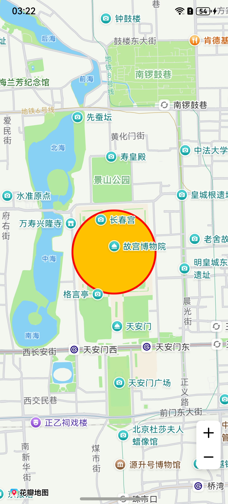

# 圆形

## 场景介绍

本章节将向您介绍如何在地图上绘制圆形。


## 接口说明

添加圆形功能主要由[MapCircleOptions](/ref/map-api/map-arkts/map-common/map-common#mapcircleoptions)、[addCircle](/ref/map-api/map-arkts/map-map/map-map-mapcomponentcontroller/map-map-mapcomponentcontroller#addcircle)和[MapCircle](/ref/map-api/map-arkts/map-map/map-map-mapcircle/map-map-mapcircle)提供，更多接口及使用方法请参见[接口文档](/ref/map-api/map-arkts/map-map/map-map-mapcircle/map-map-mapcircle)。

| 接口名 | 描述 |
| --- | --- |
| [MapCircleOptions](/ref/map-api/map-arkts/map-common/map-common#mapcircleoptions) | 圆形参数。 |
| [addCircle](/ref/map-api/map-arkts/map-map/map-map-mapcomponentcontroller/map-map-mapcomponentcontroller#addcircle)(options: [mapCommon.MapCircleOptions](/ref/map-api/map-arkts/map-common/map-common#mapcircleoptions)): Promise&lt;[MapCircle](/ref/map-api/map-arkts/map-map/map-map-mapcircle/map-map-mapcircle)&gt; | 在地图上添加一个圆，指定圆心经纬度和圆的半径，用于表示某个位置的周边范围。 |
| [MapCircle](/ref/map-api/map-arkts/map-map/map-map-mapcircle/map-map-mapcircle) | 圆形，支持更新和查询相关属性。 |

## 开发步骤

1. 导入相关模块。

   ```
   import { MapComponent, mapCommon, map } from '@kit.MapKit';
   import { AsyncCallback } from '@kit.BasicServicesKit';
   ```
2. 添加圆，在callback方法中创建初始化参数并新建Circle。

   ```
   @Entry
   @Component
   struct MapCircleDemo {
     private mapOptions?: mapCommon.MapOptions;
     private mapController?: map.MapComponentController;
     private callback?: AsyncCallback<map.MapComponentController>;
     private mapCircle?: map.MapCircle;

     aboutToAppear(): void {
       // 地图初始化参数
       this.mapOptions = {
         position: {
           target: {
             latitude: 39.918,
             longitude: 116.397
           },
           zoom: 14
         }
       };

       this.callback = async (err, mapController) => {
         if (!err) {
           this.mapController = mapController;
           // Circle初始化参数
           let mapCircleOptions: mapCommon.MapCircleOptions = {
             center: {
               latitude: 39.918,
               longitude: 116.397
             },
             radius: 500,
             clickable: true,
             fillColor: 0xFFFFC100,
             strokeColor: 0xFFFF0000,
             strokeWidth: 10,
             visible: true,
             zIndex: 15
           }
           // 创建Circle
           try {
             this.mapCircle = await this.mapController.addCircle(mapCircleOptions);
           } catch (e) {
             console.error(`Failed to create the mapCircle, code is：${e.code}, message is ${e.message}`);
           }
         } else {
           console.error(`Failed to initialize the map, code is：${err.code}, message is ${err.message}`);
         }
       };
     }

     build() {
       Stack() {
         Column() {
           MapComponent({ mapOptions: this.mapOptions, mapCallback: this.callback });
         }.width('100%')
       }.height('100%')
     }
   }
   ```

   
