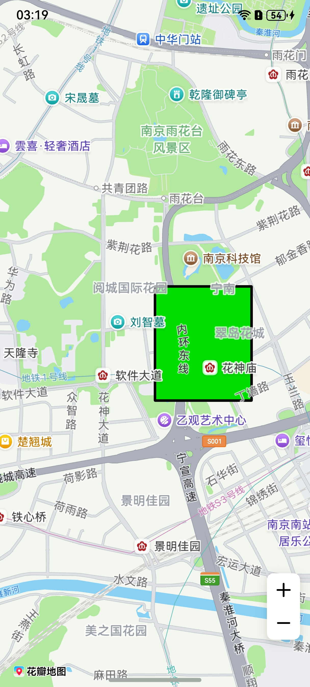

# 多边形

## 场景介绍

本章节将向您介绍如何在地图上绘制多边形。



## 接口说明

添加多边形功能主要由[MapPolygonOptions](/ref/map-api/map-arkts/map-common/map-common#mappolygonoptions)、[addPolygon](/ref/map-api/map-arkts/map-map/map-map-mapcomponentcontroller/map-map-mapcomponentcontroller#addpolygon)和[MapPolygon](/ref/map-api/map-arkts/map-map/map-map-mappolygon/map-map-mappolygon)提供，更多接口及使用方法请参见[接口文档](/ref/map-api/map-arkts/map-map/map-map-mappolygon/map-map-mappolygon)。

| 接口名 | 描述 |
| --- | --- |
| [MapPolygonOptions](/ref/map-api/map-arkts/map-common/map-common#mappolygonoptions) | 多边形参数。 |
| [addPolygon](/ref/map-api/map-arkts/map-map/map-map-mapcomponentcontroller/map-map-mapcomponentcontroller#addpolygon)(options: [mapCommon.MapPolygonOptions](/ref/map-api/map-arkts/map-common/map-common#mappolygonoptions)): Promise&lt;[MapPolygon](/ref/map-api/map-arkts/map-map/map-map-mappolygon/map-map-mappolygon)&gt; | 在地图上添加一个多边形。 |
| [MapPolygon](/ref/map-api/map-arkts/map-map/map-map-mappolygon/map-map-mappolygon) | 多边形，支持更新和查询相关属性。 |

## 开发步骤

1. 导入相关模块。

   ```
   import { MapComponent, mapCommon, map } from '@kit.MapKit';
   import { AsyncCallback } from '@kit.BasicServicesKit';
   ```
2. 添加多边形，在callback方法中创建初始化参数并新建polygon。

   ```
   @Entry
   @Component
   struct MapPolygonDemo {
     private mapOptions?: mapCommon.MapOptions;
     private mapController?: map.MapComponentController;
     private callback?: AsyncCallback<map.MapComponentController>;
     private mapPolygon?: map.MapPolygon;

     aboutToAppear(): void {
       // 地图初始化参数
       this.mapOptions = {
         position: {
           target: {
             latitude: 31.98,
             longitude: 118.78
           },
           zoom: 14
         }
       };
       this.callback = async (err, mapController) => {
         if (!err) {
           this.mapController = mapController;
           // 多边形初始化参数
           let polygonOptions: mapCommon.MapPolygonOptions = {
             points: [
               { longitude: 118.78, latitude: 31.975 },
               { longitude: 118.78, latitude: 31.985 },
               { longitude: 118.79, latitude: 31.985 },
               { longitude: 118.79, latitude: 31.975 }
             ],
             clickable: true,
             fillColor: 0xff00DE00,
             geodesic: false,
             strokeColor: 0xff000000,
             jointType: mapCommon.JointType.DEFAULT,
             strokeWidth: 10,
             visible: true,
             zIndex: 10
           }
           // 创建多边形
           try {
             this.mapPolygon = await this.mapController.addPolygon(polygonOptions);
           } catch (e) {
             console.error(`Failed to create the mapPolygon, code is：${e.code}, message is ${e.message}`);
           }
         } else {
           console.error(`Failed to initialize the map, code is：${err.code}, message is ${err.message}`);
         }
       };
     }

     build() {
       Stack() {
         Column() {
           MapComponent({ mapOptions: this.mapOptions, mapCallback: this.callback });
         }.width('100%')
       }.height('100%')
     }
   }
   ```

   
