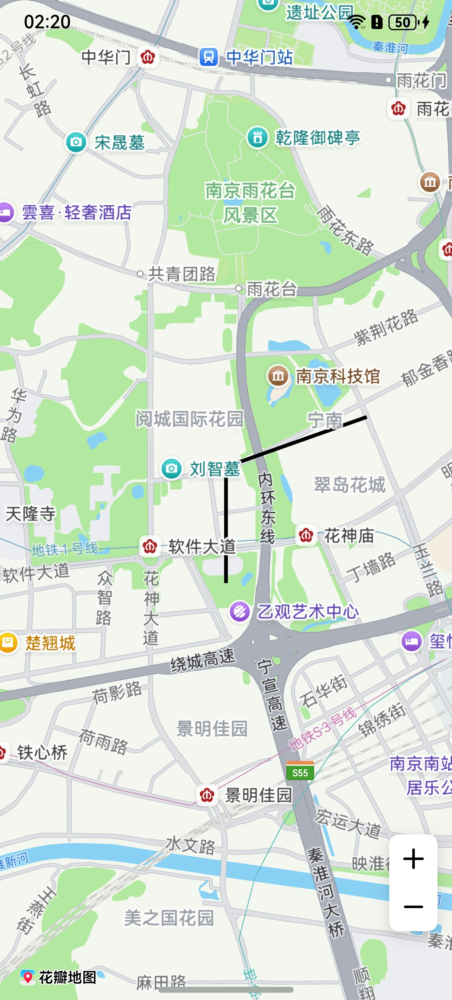
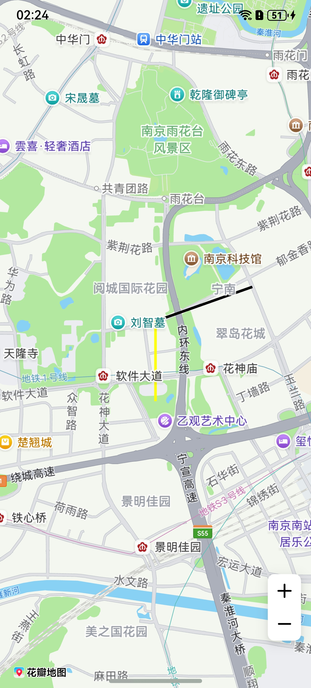
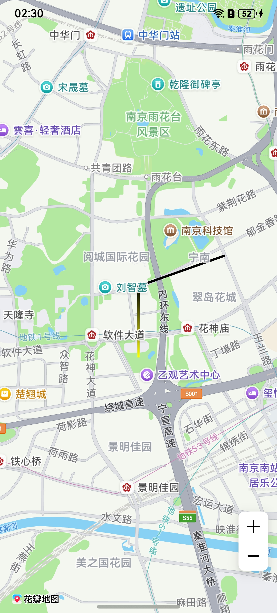
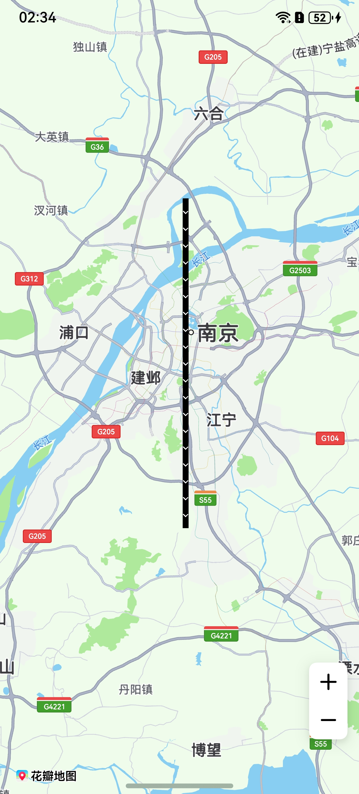
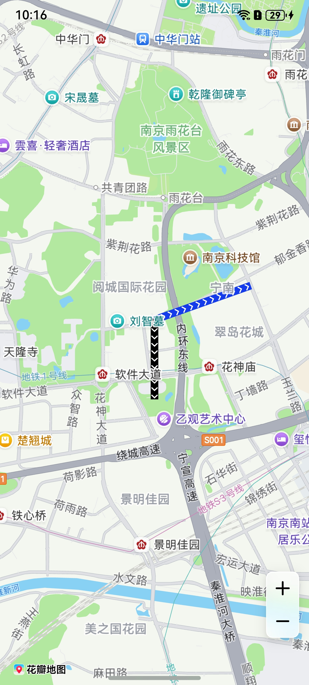

# 折线

## 场景介绍

本章节将向您介绍如何在地图上绘制折线、设置折线分段颜色、设置折线可渐变、绘制纹理。

5.0.3(15)开始，支持折线绘制纹理功能。



## 接口说明

添加折线功能主要由[MapPolylineOptions](/ref/map-api/map-arkts/map-common/map-common#mappolylineoptions)、[addPolyline](/ref/map-api/map-arkts/map-map/map-map-mapcomponentcontroller/map-map-mapcomponentcontroller#addpolyline)和[MapPolyline](/ref/map-api/map-arkts/map-map/map-map-mappolyline/map-map-mappolyline)提供，更多接口及使用方法请参见[接口文档](/ref/map-api/map-arkts/map-map/map-map-mappolyline/map-map-mappolyline)。

| 接口名 | 描述 |
| --- | --- |
| [MapPolylineOptions](/ref/map-api/map-arkts/map-common/map-common#mappolylineoptions) | 折线参数。 |
| [addPolyline](/ref/map-api/map-arkts/map-map/map-map-mapcomponentcontroller/map-map-mapcomponentcontroller#addpolyline)(options: [mapCommon.MapPolylineOptions](/ref/map-api/map-arkts/map-common/map-common#mappolylineoptions)): Promise&lt;[MapPolyline](/ref/map-api/map-arkts/map-map/map-map-mappolyline/map-map-mappolyline)&gt; | 在地图上添加一条折线。 |
| [MapPolyline](/ref/map-api/map-arkts/map-map/map-map-mappolyline/map-map-mappolyline) | 折线，支持更新和查询相关属性。 |

## 开发步骤

### 添加折线

1. 导入相关模块。

   ```
   import { MapComponent, mapCommon, map } from '@kit.MapKit';
   import { AsyncCallback } from '@kit.BasicServicesKit';
   ```
2. 添加折线，在callback方法中创建初始化参数并新建[MapPolyline](/ref/map-api/map-arkts/map-map/map-map-mappolyline/map-map-mappolyline)。

   ```
   @Entry
   @Component
   struct MapPolylineDemo {
     private mapOptions?: mapCommon.MapOptions;
     private mapController?: map.MapComponentController;
     private callback?: AsyncCallback<map.MapComponentController>;
     private mapPolyline?: map.MapPolyline;

     aboutToAppear(): void {
       // 地图初始化参数
       this.mapOptions = {
         position: {
           target: {
             latitude: 31.98,
             longitude: 118.78
           },
           zoom: 14
         }
       };
       this.callback = async (err, mapController) => {
         if (!err) {
           this.mapController = mapController;

           // polyline初始化参数
           let polylineOption: mapCommon.MapPolylineOptions = {
             points: [
               { longitude: 118.78, latitude: 31.975 },
               { longitude: 118.78, latitude: 31.982 },
               { longitude: 118.79, latitude: 31.985 }
             ],
             clickable: true,
             startCap: mapCommon.CapStyle.BUTT,
             endCap: mapCommon.CapStyle.BUTT,
             geodesic: false,
             jointType: mapCommon.JointType.BEVEL,
             visible: true,
             width: 10,
             zIndex: 10,
             gradient: false
           }
           // 创建polyline
           try {
             this.mapPolyline = await this.mapController.addPolyline(polylineOption);
           } catch (e) {
             console.error(`Failed to create the mapPolyline, code is：${e.code}, message is ${e.message}`);
           }
         } else {
           console.error(`Failed to initialize the map, code is：${err.code}, message is ${err.message}`);
         }
       };
     }

     build() {
       Stack() {
         Column() {
           MapComponent({ mapOptions: this.mapOptions, mapCallback: this.callback });
         }.width('100%')
       }.height('100%')
     }
   }
   ```

   

### 设置折线分段颜色

方法一：新建折线时在[MapPolylineOptions](/ref/map-api/map-arkts/map-common/map-common#mappolylineoptions)的colors属性中设置折线分段颜色值。

```
let polylineOption: mapCommon.MapPolylineOptions = {
  points: [
    { longitude:118.78, latitude:31.975 },
    { longitude:118.78, latitude:31.982 },
    { longitude:118.79, latitude:31.985 }
  ],
  clickable: true,
  startCap: mapCommon.CapStyle.BUTT,
  endCap: mapCommon.CapStyle.BUTT,
  geodesic: false,
  jointType: mapCommon.JointType.BEVEL,
  visible: true,
  width: 10,
  zIndex: 10,
  // 设置颜色
  colors: [0xffffff00, 0xff000000],
  gradient: false
};
```

方法二：调用[MapPolyline](/ref/map-api/map-arkts/map-map/map-map-mappolyline/map-map-mappolyline)的[setColors](/ref/map-api/map-arkts/map-map/map-map-mappolyline/map-map-mappolyline#setcolors)()方法。

```
let colors = [0xffffff00, 0xff000000];
this.mapPolyline.setColors(colors);
```



### 设置折线可渐变

方法一：[MapPolylineOptions](/ref/map-api/map-arkts/map-common/map-common#mappolylineoptions)的gradient属性设置为true。

```
let polylineOption: mapCommon.MapPolylineOptions = {
  points: [
    { longitude:118.78, latitude:31.975 },
    { longitude:118.78, latitude:31.982 },
    { longitude:118.79, latitude:31.985 }
  ],
  clickable: true,
  startCap: mapCommon.CapStyle.BUTT,
  endCap: mapCommon.CapStyle.BUTT,
  geodesic: false,
  jointType: mapCommon.JointType.BEVEL,
  visible: true,
  width: 10,
  zIndex: 10,
  colors: [0xffffff00, 0xff000000],
  // 设置颜色折线可渐变
  gradient: true
};
```

方法二：调用[MapPolyline](/ref/map-api/map-arkts/map-map/map-map-mappolyline/map-map-mappolyline)的[setGradient](/ref/map-api/map-arkts/map-map/map-map-mappolyline/map-map-mappolyline#setgradient)()方法。

```
this.mapPolyline.setGradient(true);
```



### 绘制纹理

方法一：新建折线时在[MapPolylineOptions](/ref/map-api/map-arkts/map-common/map-common#mappolylineoptions)的customTexture属性设置折线纹理。

```
let polylineOption: mapCommon.MapPolylineOptions = {
  points: [
    { latitude: 32.220750, longitude: 118.788765 },
    { latitude: 32.120750, longitude: 118.788765 },
    { latitude: 32.020750, longitude: 118.788765 },
    { latitude: 31.920750, longitude: 118.788765 },
    { latitude: 31.820750, longitude: 118.788765 }
  ],
  clickable: true,
  jointType: mapCommon.JointType.DEFAULT,
  width: 20,
  // 图标需存放在resources/rawfile目录下
  customTexture: "icon/naviline_arrow.png"
}
```

方法二：调用[MapPolyline](/ref/map-api/map-arkts/map-map/map-map-mappolyline/map-map-mappolyline)的[setCustomTexture](/ref/map-api/map-arkts/map-map/map-map-mappolyline/map-map-mappolyline#setcustomtexture)方法。

```
await this.mapPolyline.setCustomTexture("icon/naviline_arrow.png");
```



### 折线设置分段纹理

新建折线时利用在[MapPolylineOptions](/ref/map-api/map-arkts/map-common/map-common#mappolylineoptions)的customTextures和customTextureIndexes属性设置折线分段纹理。

```
import { image } from '@kit.ImageKit';

// 数组存放图片内容
let customTextures: Array<ResourceStr | image.PixelMap> = new Array();
// 图标存放在resources/rawfile，'icon/img.png'参数值传入rawfile文件夹下的相对路径
customTextures.push('icon/img.png');
customTextures.push('icon/img_1.png');
let cusIndexNumber: Array<number> = new Array();
// cusIndexNumber数组长度与折线点数量必须相同，数组元素内容与customTextures下标相对应，图片从数组第二个元素开始选择
cusIndexNumber.push(0, 0, 1);
// polyline初始化参数
let polylineOption: mapCommon.MapPolylineOptions = {
  points: [
    { longitude: 118.78, latitude: 31.975 },
    { longitude: 118.78, latitude: 31.982 },
    { longitude: 118.79, latitude: 31.985 }
  ],
  clickable: true,
  startCap: mapCommon.CapStyle.BUTT,
  endCap: mapCommon.CapStyle.BUTT,
  jointType: mapCommon.JointType.BEVEL,
  width: 30,
  // 图标需存放在resources/rawfile目录下
  customTextures: customTextures,
  customTextureIndexes: cusIndexNumber
};
let mapPolyline = await this.mapController.addPolyline(polylineOption);
```


