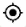
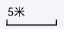
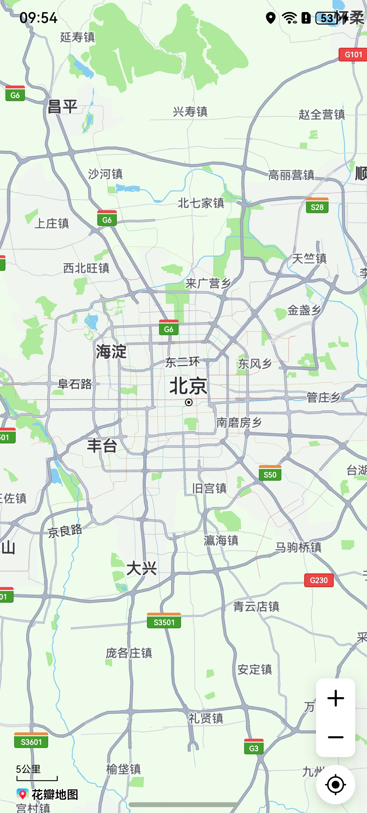
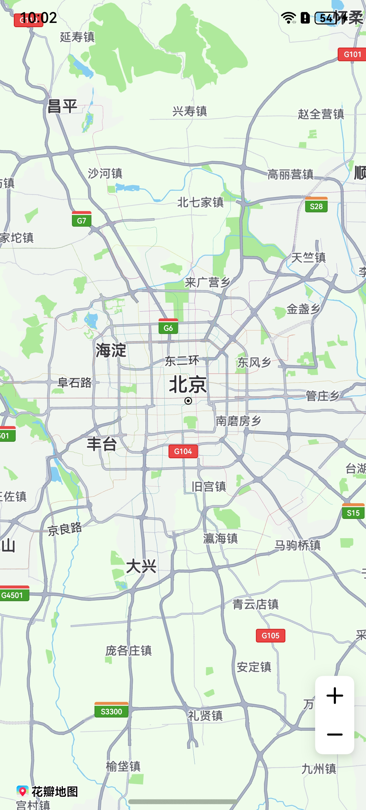
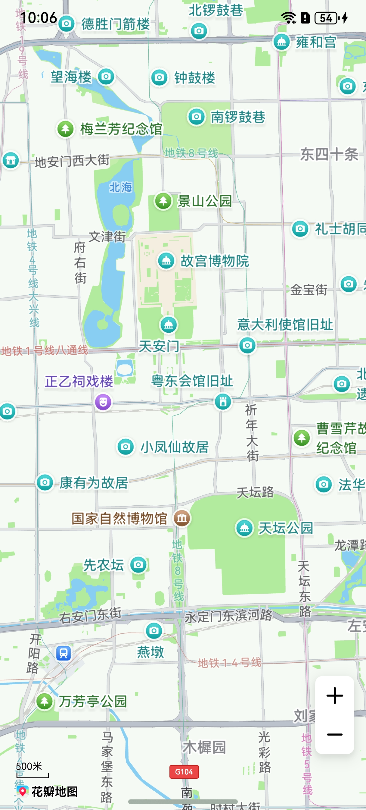
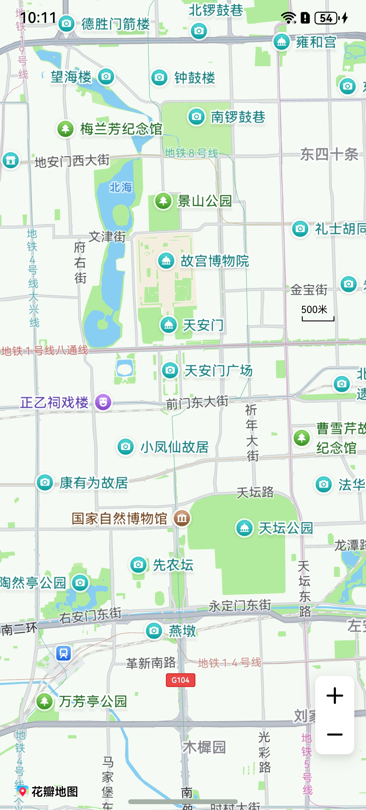
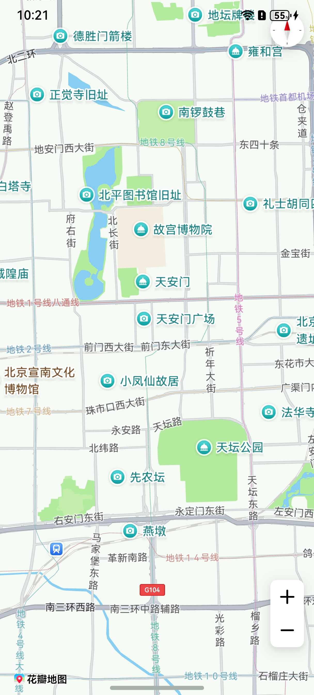
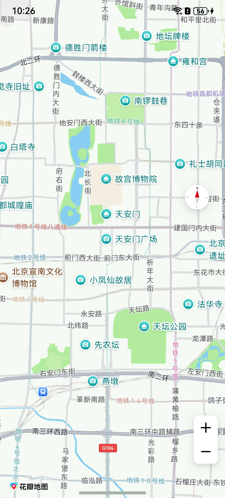
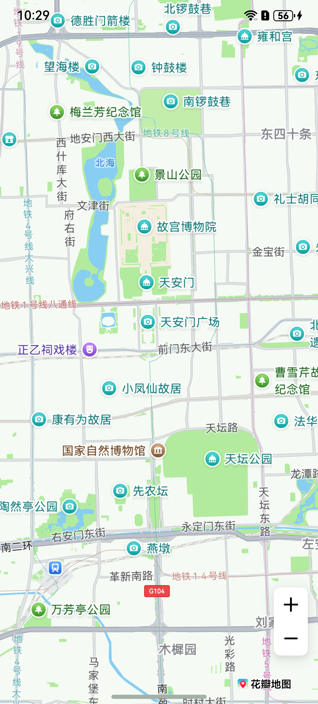
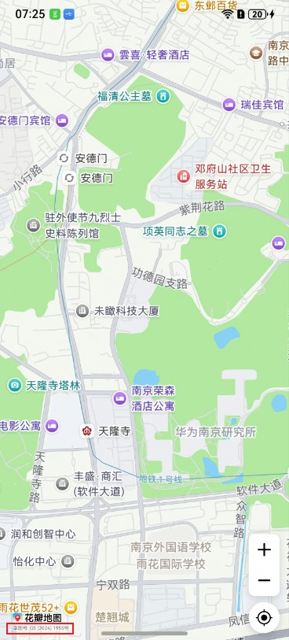

# 控件交互

## 场景介绍

从6.1.0(23)开始，支持在地图左下角设置审图号。

本章节将向您介绍如何使用地图的控件。

控件是指浮在地图组件上的一系列用于操作地图的组件，例如缩放按钮、定位按钮、比例尺等。



## 接口说明

以下是地图的控件相关接口，该功能有2种实现方式：

- 地图初始化时，可在初始化参数[MapOptions](/ref/map-api/map-arkts/map-common/map-common#mapoptions)中设置是否启用控件功能，详细讲解见[显示地图](/map-kit-guide/map-creation/map-presenting)章节。
- 通过调用[MapComponentController](/ref/map-api/map-arkts/map-map/map-map-mapcomponentcontroller/map-map-mapcomponentcontroller)提供的set方法实现相关控件的开启或关闭。

| 接口名 | 描述 |
| --- | --- |
| [setZoomControlsEnabled](/ref/map-api/map-arkts/map-map/map-map-mapcomponentcontroller/map-map-mapcomponentcontroller#setzoomcontrolsenabled)(enabled: boolean): void | 设置是否启用缩放控制器。 |
| [setMyLocationEnabled](/ref/map-api/map-arkts/map-map/map-map-mapcomponentcontroller/map-map-mapcomponentcontroller#setmylocationenabled)(myLocationEnabled: boolean): void | 设置是否启用我的位置图层。 |
| [setMyLocationControlsEnabled](/ref/map-api/map-arkts/map-map/map-map-mapcomponentcontroller/map-map-mapcomponentcontroller#setmylocationcontrolsenabled)(enabled: boolean): void | 设置是否启用我的位置按钮。 |
| [setScaleControlsEnabled](/ref/map-api/map-arkts/map-map/map-map-mapcomponentcontroller/map-map-mapcomponentcontroller#setscalecontrolsenabled)(enabled: boolean): void | 设置是否启用比例尺。 |
| [setScalePosition](/ref/map-api/map-arkts/map-map/map-map-mapcomponentcontroller/map-map-mapcomponentcontroller#setscaleposition)(point: [mapCommon.MapPoint](/ref/map-api/map-arkts/map-common/map-common#mappoint)): void | 设置比例尺控件的位置。 |
| [setAlwaysShowScaleEnabled](/ref/map-api/map-arkts/map-map/map-map-mapcomponentcontroller/map-map-mapcomponentcontroller#setalwaysshowscaleenabled)(enabled: boolean): void | 设置是否始终显示比例尺。 |
| [setCompassControlsEnabled](/ref/map-api/map-arkts/map-map/map-map-mapcomponentcontroller/map-map-mapcomponentcontroller#setcompasscontrolsenabled)(enabled: boolean): void | 设置是否启用指南针。 |
| [setLogoAlignment](/ref/map-api/map-arkts/map-map/map-map-mapcomponentcontroller/map-map-mapcomponentcontroller#setlogoalignment)(alignment: [mapCommon.LogoAlignment](/ref/map-api/map-arkts/map-common/map-common#logoalignment)): void | 设置地图Logo的对齐方式。 |
| [setApproveNumberEnabled](/ref/map-api/map-arkts/map-map/map-map-mapcomponentcontroller/map-map-mapcomponentcontroller#setapprovenumberenabled)(enabled: boolean): void | 设置是否显示审图号，只有路由地在中国才会显示。 |

## 开发步骤

mapController对象在初始化地图时获取，初始化地图功能在[显示地图](/map-kit-guide/map-creation/map-presenting)章节中有详细讲解。

### 缩放控件

Map Kit提供了内置的缩放控件，默认情况下是开启的。

```
// 开启缩放控件
this.mapController.setZoomControlsEnabled(true);
```



### 比例尺

Map Kit提供了内置的比例尺控件，默认情况下是关闭的。

```
// 开启比例尺控件
this.mapController.setScaleControlsEnabled(true);
```



****调整比例尺位置：****

可通过[setScalePosition](/ref/map-api/map-arkts/map-map/map-map-mapcomponentcontroller/map-map-mapcomponentcontroller#setscaleposition)方法设置比例尺控件的位置。

```
let point: mapCommon.MapPoint = {
  // 以当前地图组件左上角为原点，向右移动1000px
  positionX: 1000,
  // 以当前地图组件左上角为原点，向下移动1000px
  positionY: 1000
};
this.mapController.setScalePosition(point);
```



****获取当前层级的比例尺大小：****

可通过[getScaleLevel](/ref/map-api/map-arkts/map-map/map-map-mapcomponentcontroller/map-map-mapcomponentcontroller#getscalelevel)方法获取当前层级比例尺大小。

```
let level = this.mapController.getScaleLevel();
```

****获取比例尺控件宽高：****

可通过[getScaleControlsHeight](/ref/map-api/map-arkts/map-map/map-map-mapcomponentcontroller/map-map-mapcomponentcontroller#getscalecontrolsheight)和[getScaleControlsWidth](/ref/map-api/map-arkts/map-map/map-map-mapcomponentcontroller/map-map-mapcomponentcontroller#getscalecontrolswidth)方法获取当前比例尺控件宽高。

```
// 获取比例尺控件的高度
let height = this.mapController.getScaleControlsHeight();
// 获取比例尺控件的宽度
let width = this.mapController.getScaleControlsWidth();
```

****设置比例尺控件常显：****

可通过[setAlwaysShowScaleEnabled](/ref/map-api/map-arkts/map-map/map-map-mapcomponentcontroller/map-map-mapcomponentcontroller#setalwaysshowscaleenabled)方法设置比例尺控件常显，通过[isAlwaysShowScaleEnabled](/ref/map-api/map-arkts/map-map/map-map-mapcomponentcontroller/map-map-mapcomponentcontroller#isalwaysshowscaleenabled)方法查询比例尺控件是否常显。

```
// 设置比例尺控件常显
this.mapController.setAlwaysShowScaleEnabled(true);
// 查询比例尺控件是否常显
let scaleEnabled: boolean = this.mapController.isAlwaysShowScaleEnabled();
```

### 指南针

Map Kit提供了内置的指南针控件，默认情况下是开启的，控件位置默认显示在地图的右上角。如果是启用状态，当地图不是指向正北方向或者发生倾斜时，地图右上角会显示一个指南针图标，点击指南针可使地图旋转为正北方向并且取消倾斜；当地图为正北方向且未发生倾斜时，指南针图标隐藏。如果是禁用状态，将不会显示指南针图标。

```
// 开启指南针控件
this.mapController.setCompassControlsEnabled(true);
```



****调整指南针位置：****

可通过[setCompassPosition](/ref/map-api/map-arkts/map-map/map-map-mapcomponentcontroller/map-map-mapcomponentcontroller#setcompassposition)方法设置指南针控件的位置。

```
let point: mapCommon.MapPoint = {
  // 以当前地图组件左上角为原点，向右移动1000px
  positionX: 1000,
  // 以当前地图组件左上角为原点，向下移动1000px
  positionY: 1000
};
this.mapController.setCompassPosition(point);
```



### 地图Logo

Map Kit提供了调整地图Logo对齐方式的方法[setLogoAlignment](/ref/map-api/map-arkts/map-map/map-map-mapcomponentcontroller/map-map-mapcomponentcontroller#setlogoalignment)和调整地图边界与Logo之间的间距的方法[setLogoPadding](/ref/map-api/map-arkts/map-map/map-map-mapcomponentcontroller/map-map-mapcomponentcontroller#setlogopadding)。需注意，地图Logo不允许被遮挡，可通过[setLogoPadding](/ref/map-api/map-arkts/map-map/map-map-mapcomponentcontroller/map-map-mapcomponentcontroller#setlogopadding)方法设置地图边界区域，来避免logo被遮挡。

```
// 将Logo放置在右下角位置
this.mapController.setLogoAlignment(mapCommon.LogoAlignment.BOTTOM_END);
// 设置地图边界与Logo之间的间距，单位：px
let padding: mapCommon.Padding = {
  right: 50,
  bottom: 50
};
this.mapController.setLogoPadding(padding);
```



### 审图号

审图号是指国家对地图产品进行审核并颁发的编号，用于标识地图已通过国家测绘地理信息局的审查。

Map Kit通过方法[setApproveNumberEnabled](/ref/map-api/map-arkts/map-map/map-map-mapcomponentcontroller/map-map-mapcomponentcontroller#setapprovenumberenabled)展示审图号。如图左下角：

```
// 显示审图号
this.mapController?.setApproveNumberEnabled(true);
```


