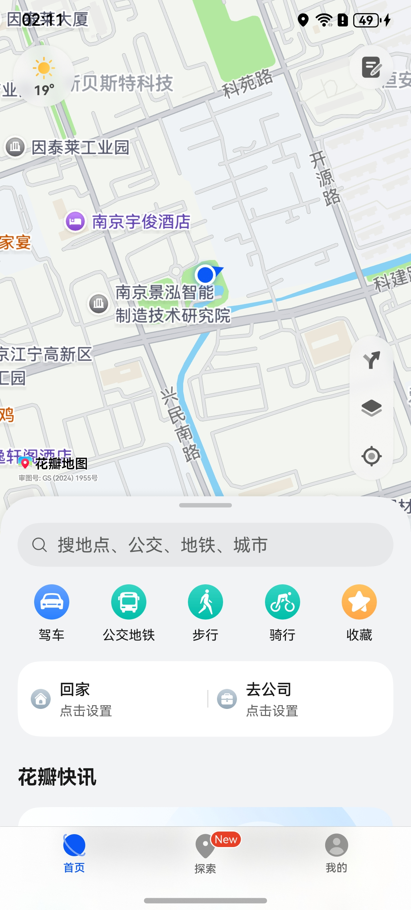
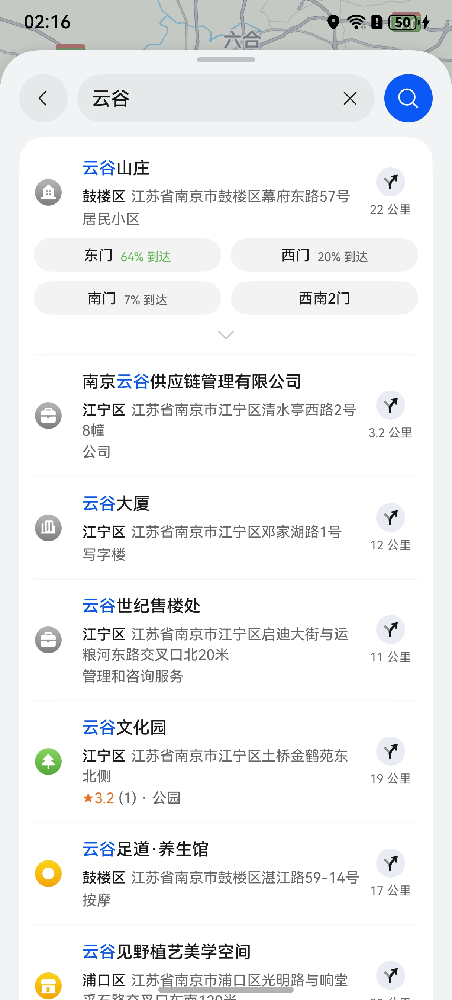
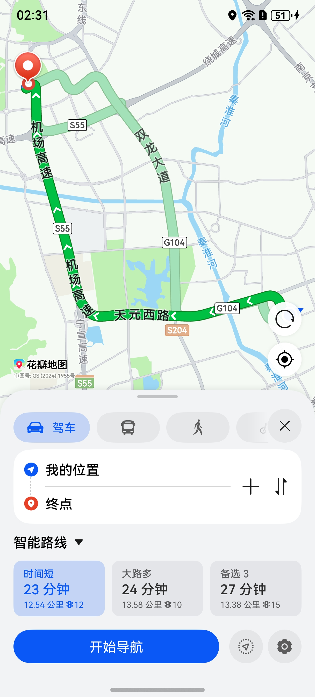
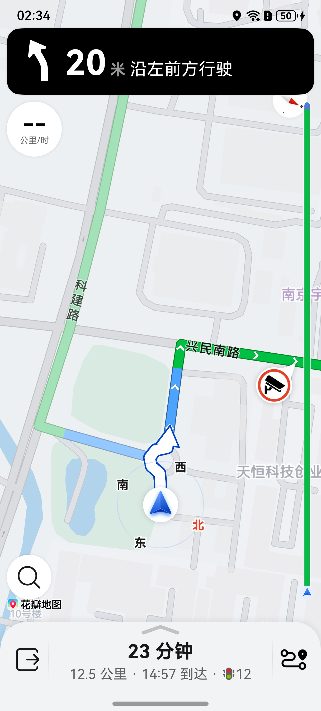
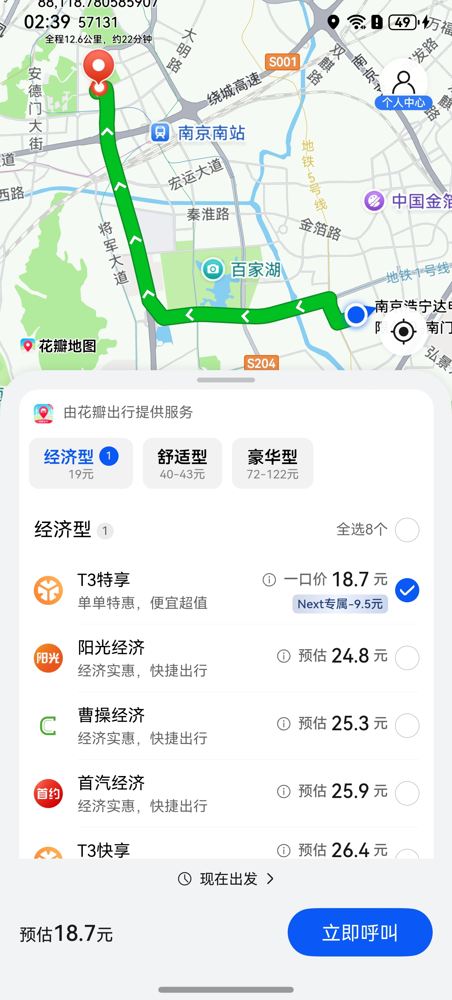

# 通过地图应用实现导航等能力

## 场景介绍

从5.0.3(15)开始，支持地图应用首页、搜索地点、查看地点详情、规划路线和进行导航功能；从6.0.1(21)开始，支持地图应用发起打车功能。

本章节将向您介绍如何打开地图应用实现如下能力：

- 打开地图应用首页
- 打开地图应用搜索地点
- 打开地图应用查看地点详情
- 打开地图应用规划路线
- 打开地图应用进行导航
- 打开地图应用发起打车

## 接口说明

调用地图应用的功能主要通过[petalMaps](/ref/map-api/map-arkts/map-petal-maps/map-petal-maps)命名空间下的[openMapHomePage](/ref/map-api/map-arkts/map-petal-maps/map-petal-maps#openmaphomepage)、[openMapTextSearch](/ref/map-api/map-arkts/map-petal-maps/map-petal-maps#openmaptextsearch)、[openMapPoiDetail](/ref/map-api/map-arkts/map-petal-maps/map-petal-maps#openmappoidetail)、[openMapRoutePlan](/ref/map-api/map-arkts/map-petal-maps/map-petal-maps#openmaprouteplan)、[openMapNavi](/ref/map-api/map-arkts/map-petal-maps/map-petal-maps#openmapnavi)、[openMapTaxi](/ref/map-api/map-arkts/map-petal-maps/map-petal-maps#openmaptaxi)等接口实现，更多接口及使用方法请参见[接口文档](/ref/map-api/map-arkts/map-petal-maps/map-petal-maps)。

| 接口说明 | 描述 |
| --- | --- |
| [TextSearchParams](/ref/map-api/map-arkts/map-petal-maps/map-petal-maps#textsearchparams) | 文本搜索的参数。 |
| [PoiDetailParams](/ref/map-api/map-arkts/map-petal-maps/map-petal-maps#poidetailparams) | POI详情的参数。 |
| [RoutePlanParams](/ref/map-api/map-arkts/map-petal-maps/map-petal-maps#routeplanparams) | 路线规划的参数。 |
| [NaviParams](/ref/map-api/map-arkts/map-petal-maps/map-petal-maps#naviparams) | 导航的参数。 |
| [TaxiParams](/ref/map-api/map-arkts/map-petal-maps/map-petal-maps#taxiparams) | 打车的参数。 |
| [openMapHomePage](/ref/map-api/map-arkts/map-petal-maps/map-petal-maps#openmaphomepage)(context: [common.Context](/ref/ability-api/ability-arkts/ability-api-interface-depend/ability-arkts-application/js-apis-inner-application-context/js-apis-inner-application-context)): Promise&lt;void&gt; | 打开地图应用首页。 |
| [openMapTextSearch](/ref/map-api/map-arkts/map-petal-maps/map-petal-maps#openmaptextsearch)(context: [common.Context](/ref/ability-api/ability-arkts/ability-api-interface-depend/ability-arkts-application/js-apis-inner-application-context/js-apis-inner-application-context), textSearchParams: [TextSearchParams](/ref/map-api/map-arkts/map-petal-maps/map-petal-maps#textsearchparams)): Promise&lt;void&gt; | 打开地图应用搜索地点。 |
| [openMapPoiDetail](/ref/map-api/map-arkts/map-petal-maps/map-petal-maps#openmappoidetail)(context: [common.Context](/ref/ability-api/ability-arkts/ability-api-interface-depend/ability-arkts-application/js-apis-inner-application-context/js-apis-inner-application-context), poiDetailParams: [PoiDetailParams](/ref/map-api/map-arkts/map-petal-maps/map-petal-maps#poidetailparams)): Promise&lt;void&gt; | 打开地图应用查看地点详情。 |
| [openMapRoutePlan](/ref/map-api/map-arkts/map-petal-maps/map-petal-maps#openmaprouteplan)(context: [common.Context](/ref/ability-api/ability-arkts/ability-api-interface-depend/ability-arkts-application/js-apis-inner-application-context/js-apis-inner-application-context), routePlanParams: [RoutePlanParams](/ref/map-api/map-arkts/map-petal-maps/map-petal-maps#routeplanparams)): Promise&lt;void&gt; | 打开地图应用规划路线。 |
| [openMapNavi](/ref/map-api/map-arkts/map-petal-maps/map-petal-maps#openmapnavi)(context: [common.Context](/ref/ability-api/ability-arkts/ability-api-interface-depend/ability-arkts-application/js-apis-inner-application-context/js-apis-inner-application-context), naviParams: [NaviParams](/ref/map-api/map-arkts/map-petal-maps/map-petal-maps#naviparams)): Promise&lt;void&gt; | 打开地图应用进行导航。 |
| [openMapTaxi](/ref/map-api/map-arkts/map-petal-maps/map-petal-maps#openmaptaxi)(context: [common.Context](/ref/ability-api/ability-arkts/ability-api-interface-depend/ability-arkts-application/js-apis-inner-application-context/js-apis-inner-application-context), taxiParams: [TaxiParams](/ref/map-api/map-arkts/map-petal-maps/map-petal-maps#taxiparams)): Promise&lt;void&gt; | 打开地图应用打车页面。 |

## 地图应用使用的坐标类型

在国内站点，中国大陆使用GCJ02坐标系，中国台湾使用WGS84坐标系。

在海外站点，统一使用WGS84坐标系。坐标系转换参考：[坐标纠偏](/map-kit-guide/map-calculation-tool/map-convert-coordinate)。

## 开发步骤

导入相关模块

```
import { petalMaps } from '@kit.MapKit'
```

### 打开地图应用首页

通过[openMapHomePage](/ref/map-api/map-arkts/map-petal-maps/map-petal-maps#openmaphomepage)，打开地图应用首页。

```
try {
  await petalMaps.openMapHomePage(this.getUIContext().getHostContext());
} catch (e) {
  console.error(`code:${e.code}, message:${e.message}`);
}
```

****图1**** 打开地图应用首页



### 打开地图应用进行地点搜索

通过[openMapTextSearch](/ref/map-api/map-arkts/map-petal-maps/map-petal-maps#openmaptextsearch)，传入搜索目标名称，打开地图应用进行地点搜索。

```
try {
  let params: petalMaps.TextSearchParams = {
    destinationName: '云谷'
  };
  await petalMaps.openMapTextSearch(this.getUIContext().getHostContext(), params);
} catch (e) {
  console.error(`code:${e.code}, message:${e.message}`);
}
```

****图2**** 打开地图应用进行地点搜索



### 打开地图应用查看地点详情

通过[openMapPoiDetail](/ref/map-api/map-arkts/map-petal-maps/map-petal-maps#openmappoidetail)，传入地点的经纬度，打开地图应用查看地点详情。

```
try {
  let params: petalMaps.PoiDetailParams = {
    destinationPosition: {
      latitude: 32.02065982629459,
      longitude: 118.788899213002
    },
    destinationPoiId: '563233191438217472'
  };
  await petalMaps.openMapPoiDetail(this.getUIContext().getHostContext(), params);
} catch (e) {
  console.error(`code:${e.code}, message:${e.message}`);
}
```

****图3**** 打开地图应用查看地点详情


### 打开地图应用规划路线

通过[openMapRoutePlan](/ref/map-api/map-arkts/map-petal-maps/map-petal-maps#openmaprouteplan)，传入终点经纬度，打开地图应用规划路线。

```
try {
  let params: petalMaps.RoutePlanParams = {
    destinationPosition: {
      latitude: 31.983015468224288,
      longitude: 118.78058590757131
    }
  };
  await petalMaps.openMapRoutePlan(this.getUIContext().getHostContext(), params);
} catch (e) {
  console.error(`code:${e.code}, message:${e.message}`);
}
```

****图4**** 打开地图应用规划路线



### 打开地图应用进行导航

通过[openMapNavi](/ref/map-api/map-arkts/map-petal-maps/map-petal-maps#openmapnavi)，传入终点经纬度，打开地图应用发起导航。

```
try {
  let params: petalMaps.NaviParams = {
    destinationPosition: {
      latitude: 31.983015468224288,
      longitude: 118.78058590757131
    }
  };
  await petalMaps.openMapNavi(this.getUIContext().getHostContext(), params);
} catch (e) {
  console.error(`code:${e.code}, message:${e.message}`);
}
```

****图5**** 打开地图应用进行导航



### 打开地图应用打车页面

通过[openMapTaxi](/ref/map-api/map-arkts/map-petal-maps/map-petal-maps#openmaptaxi)，传入终点经纬度，打开地图应用发起打车。

```
try {
  let params: petalMaps.TaxiParams = {
    destinationPosition: {
      latitude: 31.983015468224288,
      longitude: 118.78058590757131
    }
  };
  await petalMaps.openMapTaxi(this.getUIContext().getHostContext(), params);
} catch (e) {
  console.error(`code:${e.code}, message:${e.message}`);
}
```

****图6**** 打开地图应用进行打车


