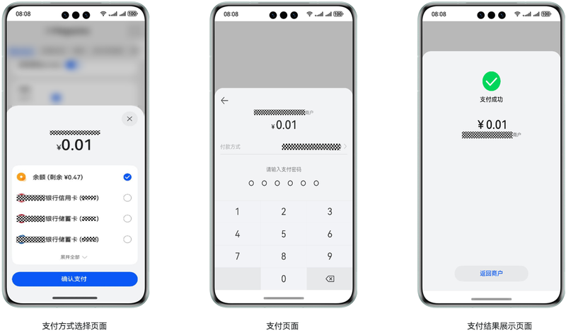
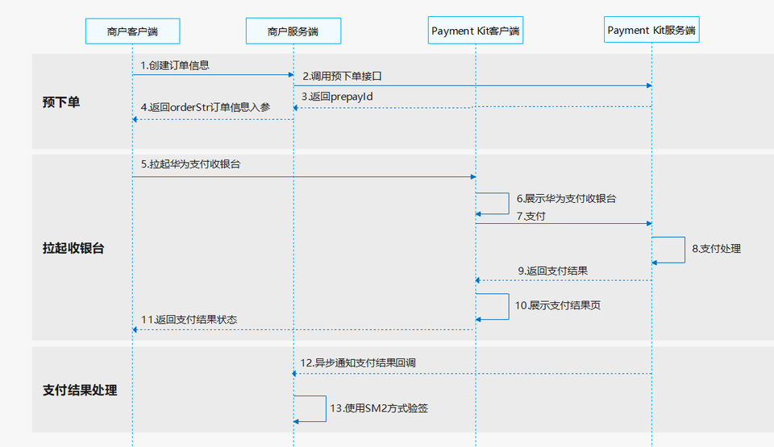

# 商户基础支付场景

## 场景介绍

从4.1.0(11)版本开始，新增支持商户基础支付场景。

例如用户出行需要提前预订酒店房间，此时用户可打开商户开发的APP应用/元服务，选好预订房间后发起支付，商户通过接入华为支付拉起华为支付收银台完成单个订单支付。

支持商户模型：直连商户、平台类商户、服务商

华为支付收银台展示：



## 业务流程

开发者通过接入Payment Kit基础支付，可以简便快捷的实现应用的支付能力。具体接入流程如下：



1. 商户客户端请求商户服务器创建商品订单。
2. 商户服务器按照商户模型调用Payment Kit服务端[直连商户预下单](/ref/payment-api/payment-rest/payment-merc/payment-pay/payment-prepay/payment-prepay)或[平台类商户/服务商预下单](/ref/payment-api/payment-rest/payment-agent-merc/payment-partner-pay/payment-agent-prepay/payment-agent-prepay)接口。
3. Payment Kit服务端返回预支付ID（prepayId）。
4. 商户服务端组建订单信息参数[orderStr](/ref/payment-api/payment-model/payment-model#orderstr)返回给商户客户端。
5. 商户客户端调用[requestPayment](/ref/payment-api/payment-arkts/payment-paymentservice/payment-paymentservice#paymentservicerequestpayment)接口拉起Payment Kit支付收银台。
6. Payment Kit客户端展示收银台。
7. 用户通过收银台完成支付，Payment Kit客户端会收到支付结果信息并请求Payment Kit服务端处理支付。
8. Payment Kit服务端成功受理支付订单并异步处理支付。
9. Payment Kit服务端将支付结果返回给Payment Kit客户端。
10. Payment Kit客户端展示支付结果页。
11. 用户关闭支付结果页后Payment Kit客户端会返回支付状态给商户客户端。
12. 支付处理完成后，Payment Kit服务端会调用回调接口返回支付结果信息给商户服务端。
13. 商户服务端收到支付结果回调响应后，使用[SM2验签方式](/ref/payment-api/payment-rest/payment-rest-overview/payment-rest-overview#验签规则)对支付结果进行验签。

## 接口说明

接口返回值有两种返回形式：Promise和AsyncCallback。Promise和AsyncCallback只是返回方式不一样，功能相同。具体API说明详见[接口文档](/ref/payment-api/payment-arkts/payment-paymentservice/payment-paymentservice)。

| 接口名 | 描述 |
| --- | --- |
| requestPayment(context:common.UIAbilityContext, orderStr: string): Promise&lt;void&gt;; | 拉起Payment Kit支付收银台。 |
| requestPayment(context:common.UIAbilityContext, orderStr: string, callback: AsyncCallback&lt;void&gt;): void; | 拉起Payment Kit支付收银台。 |

## 开发步骤

### 预下单（服务器开发）

1. 开发者按照商户模型调用[直连商户预下单](/ref/payment-api/payment-rest/payment-merc/payment-pay/payment-prepay/payment-prepay)或[平台类商户/服务商预下单](/ref/payment-api/payment-rest/payment-agent-merc/payment-partner-pay/payment-agent-prepay/payment-agent-prepay)接口获取预支付ID（prepayId）。

   为保证支付订单的安全性和可靠性需要对请求body和请求头PayMercAuth对象内的入参排序拼接进行签名，可参考[签名规则](/ref/payment-api/payment-rest/payment-rest-overview/payment-rest-overview#签名规则)。
2. 构建订单信息参数[orderStr](/ref/payment-api/payment-model/payment-model#orderstr)。

   商户服务器需要将客户端支付接口入参orderStr签名后返回给客户端。

    

   [orderStr](/ref/payment-api/payment-model/payment-model#orderstr)中sign字段签名规则是将除sign外的参数都做排序拼接后再签名（参见[签名规则](/ref/payment-api/payment-rest/payment-rest-overview/payment-rest-overview#签名规则)），签名值赋值给sign字段。

   以下为开放API接口请求及orderStr构建[示例代码](https://gitcode.com/HarmonyOS_Samples/paymentkit-sample-code-serverdemo-java)片段：

   ```
   import com.huawei.petalpay.paymentservice.apiservice.client.model.BaseGwRspWithSign;
   import com.huawei.petalpay.paymentservice.apiservice.client.model.PreOrderCreateRequestV2;
   import com.huawei.petalpay.paymentservice.apiservice.client.model.PreOrderCreateResponse;
   import com.huawei.petalpay.paymentservice.apiservice.client.model.PreSignRequestV2;
   import com.huawei.petalpay.paymentservice.apiservice.client.model.PreSignResponse;
   import com.huawei.petalpay.paymentservice.core.client.DefaultPetalPayClient;
   import com.huawei.petalpay.paymentservice.core.client.PetalPayClient;
   import com.huawei.petalpay.paymentservice.example.common.CommonResponse;
   import com.huawei.petalpay.paymentservice.example.common.MercConfigUtil;
   import lombok.extern.slf4j.Slf4j;

   public class MercApiController {
       private static PetalPayClient payClient = new DefaultPetalPayClient(MercConfigUtil.getMercConfig());
       /**
        * 预下单接口调用
        */
       public CommonResponse aggrPreOrderForAppV2() {
           // 组装对象
           PreOrderCreateRequestV2 preOrderReq = getPreOrderCreateRequestV2();
           PreOrderCreateResponse response = null;
           try {
               response = payClient.execute("POST", "/api/v2/aggr/preorder/create/app", PreOrderCreateResponse.class,
                   preOrderReq);
           } catch (Exception e) {
               // todo 异常处理
               log.error("request error ", e);
               return CommonResponse.buildErrorRsp(e.getMessage());
           }
           if (!validResponse(response)) {
               // todo 异常处理
               log.error("response is invalid ", response);
               return CommonResponse.buildFailRsp(response);
           }
           return CommonResponse.buildSuccessRsp(payClient.buildOrderStr(response.getPrepayId()));
       }
       public static boolean validResponse(BaseGwRspWithSign rsp) {
           return rsp != null && "000000".equals(rsp.getResultCode());
       }
       /**
        * 预下单接口请求参数组装，商户请根据业务自行实现
        */
       public static PreOrderCreateRequestV2 getPreOrderCreateRequestV2() {
           return PreOrderCreateRequestV2.builder()
               .mercOrderNo("pay-example-" + System.currentTimeMillis()) // 每次订单号都要变，请将pay-example-修改为商户自己的订单前缀
               .appId(MercConfigUtil.APP_ID)  // appId，需要配置为与商户绑定的正确的appId
               .mercNo(MercConfigUtil.MERC_NO) // 商户的商户号
               .tradeSummary("请修改为对应的商品简称") // 请修改为商品简称
               .totalAmount(2L)
               .callbackUrl("https://www.xxxxxx.com/hw/pay/callback") // 回调通知地址，通知URL必须为直接可访问的URL，要求为https地址。最大长度为512。请替换为格式正确的结果通知回调地址。
               .build();
       }
   }
   ```

### 拉起华为支付收银台（端侧开发）

商户客户端使用[orderStr](/ref/payment-api/payment-model/payment-model#orderstr)作为参数调用[requestPayment](/ref/payment-api/payment-arkts/payment-paymentservice/payment-paymentservice#paymentservicerequestpayment)接口拉起Payment Kit支付收银台。

当接口通过.then()方法返回时，则表示当前订单支付成功，通过.catch()方法返回表示订单支付失败。当此次请求有异常时，可通过****error.code****获取错误码，错误码相关信息请参见[错误码](/ref/payment-api/payment-arkts/payment-error-code/payment-error-code)。示例代码如下：

```
import { BusinessError } from '@kit.BasicServicesKit';
import { paymentService } from '@kit.PaymentKit';
import { common } from '@kit.AbilityKit';

@Entry
@Component
struct Index {
  context: common.UIAbilityContext = this.getUIContext().getHostContext() as common.UIAbilityContext;
  requestPaymentPromise() {
    // use your own orderStr
    const orderStr = '{"app_id":"***","merc_no":"***","prepay_id":"xxx","timestamp":"1680259863114","noncestr":"1487b8a60ed9f9ecc0ba759fbec23f4f","sign":"****","auth_id":"***"}';
    paymentService.requestPayment(this.context, orderStr)
      .then(() => {
        // pay success
        console.info('succeeded in paying');
      })
      .catch((error: BusinessError) => {
        // failed to pay
        console.error(`failed to pay, error.code: ${error.code}, error.message: ${error.message}`);
      });
  }

  build() {
    Column() {
      Button('requestPaymentPromise')
        .type(ButtonType.Capsule)
        .width('50%')
        .margin(20)
        .onClick(() => {
          this.requestPaymentPromise();
        })
      }
    .width('100%')
    .height('100%')
  }
}
```

 

- 如果用户没有提前登录，系统会自动拉起华为账号登录页面让用户登录。
- 支付成功，不建议以客户端返回作为用户的支付结果，需以服务器接收到的结果通知或者查询API返回为准。

### 支付结果回调通知（服务器开发）

支付成功后华为支付服务器会调用开发者提供的回调接口，将支付信息返回给开发者的服务器，回调详细信息按商户模式请参见[直连商户支付结果回调通知](/ref/payment-api/payment-rest/payment-merc/payment-pay/payment-pay-notify/payment-pay-notify)或[平台类商户/服务商支付结果回调通知](/ref/payment-api/payment-rest/payment-agent-merc/payment-partner-pay/payment-agent-pay-notify/payment-agent-pay-notify)。

 

回调接口是开发者调用预下单时的入参字段callbackUrl。

为保证信息合法性，商户服务器需要对返回的支付信息进行[SM2验签](/ref/payment-api/payment-rest/payment-rest-overview/payment-rest-overview#验签规则)，验签注意事项：

1. 需直接使用通知的完整内容进行验签。
2. 验签前需要对返回数据进行排序拼接，sign字段是签名值，排序拼接后的待验签内容需要排除sign字段。
3. 验签公钥使用[华为支付证书](/payment-kit-guide/payment-preparations/payment-certificates-config#华为支付证书)。

## 延伸和拓展

当开发者完成上述能力之后还可以调用以下API接口完成订单相关操作。

### 直连商户

[查询支付订单](/ref/payment-api/payment-rest/payment-merc/payment-pay-and-sign-api/payment-pas-query-order/payment-pas-merc-query-order/payment-pas-merc-query-order)、[申请退款](/ref/payment-api/payment-rest/payment-merc/payment-pay/payment-service--refund/payment-service--refund)、[查询退款订单](/ref/payment-api/payment-rest/payment-merc/payment-pay/payment-query-refund/payment-merc-query-refund/payment-merc-query-refund)、[查询对账单](/ref/payment-api/payment-rest/payment-merc/payment-bill/payment-query-trade-bill/payment-query-trade-bill)、[查询结算账单](/ref/payment-api/payment-rest/payment-merc/payment-bill/payment-query-settle-bill/payment-query-settle-bill)。

### 平台类商户/服务商

[查询支付订单](/ref/payment-api/payment-rest/payment-agent-merc/payment-partner-pay-and-sign/payment-partner-pas-query-order/payment-partner-pas-merc-query-order/payment-partner-pas-merc-query-order)、[申请退款](/ref/payment-api/payment-rest/payment-agent-merc/payment-partner-pay/payment-agent-refund/payment-agent-refund)、[查询退款订单](/ref/payment-api/payment-rest/payment-agent-merc/payment-partner-pay/payment-agentmerc-query-refund/payment-agent-merc-query-refund/payment-agent-merc-query-refund)、[查询对账单](/ref/payment-api/payment-rest/payment-agent-merc/payment-partner-bill/payment-partner-agent-query-trade-bill/payment-partner-agent-query-trade-bill)、[查询结算账单](/ref/payment-api/payment-rest/payment-agent-merc/payment-partner-bill/payment-partner-agent-query-settle-bill/payment-partner-agent-query-settle-bill)。
