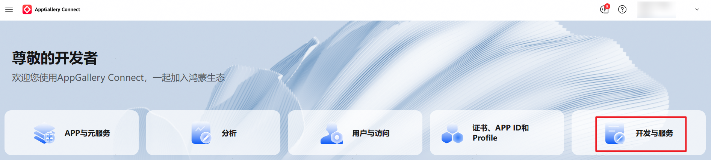
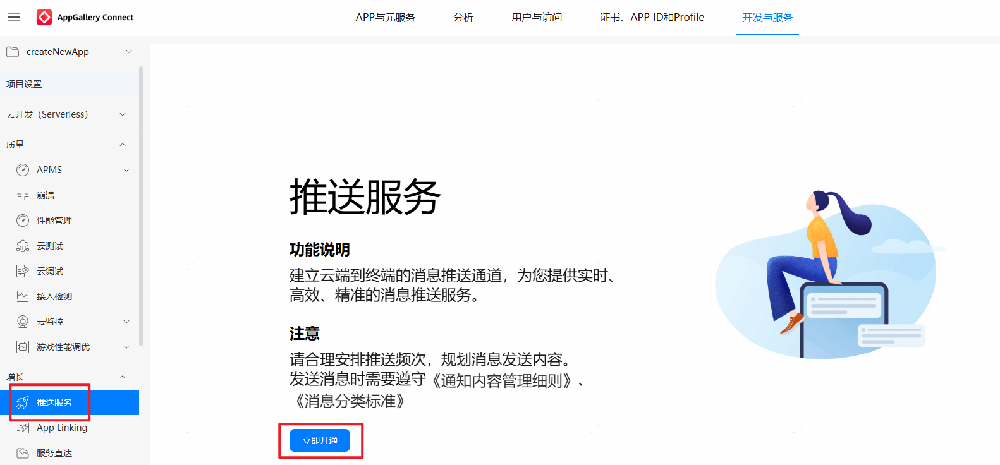
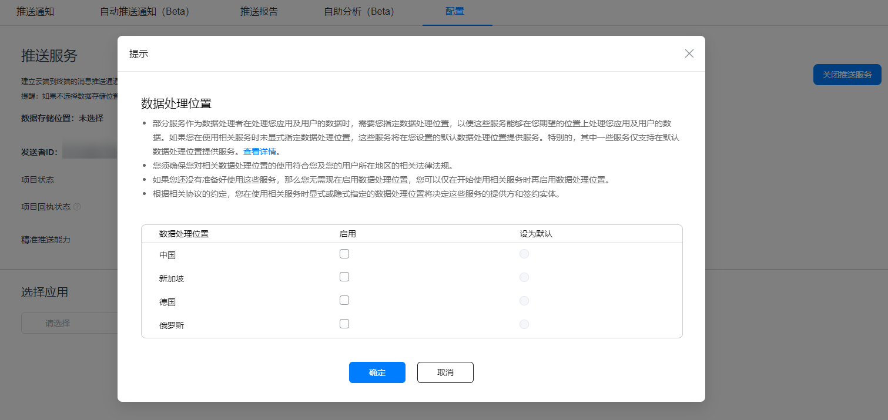
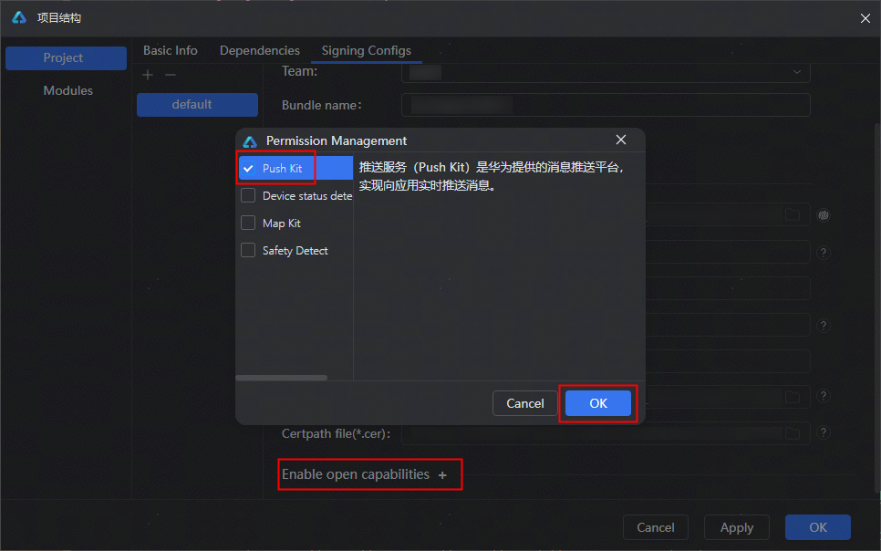
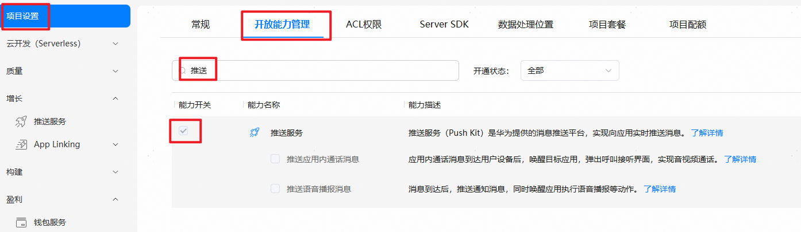
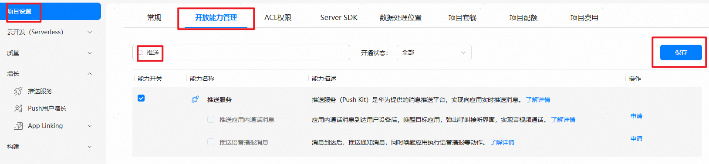
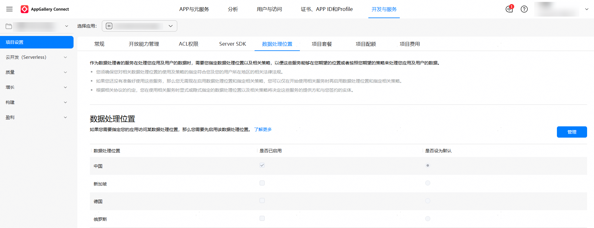

# 开通推送服务

在开通推送服务前，请先参考“[应用开发准备](/application-dev-overview)”创建项目和应用工程。

 

从HarmonyOS NEXT Developer Beta2起，开发者无需配置公钥指纹和Client ID。

## 操作步骤

1. 登录[AppGallery Connect](https://developer.huawei.com/consumer/cn/service/josp/agc/index.html)网站，选择“开发与服务”。

   
2. 在项目列表中找到您的项目，在项目下的应用列表中选择需要配置推送服务参数的应用。

   
3. 在左侧导航栏选择“增长 > 推送服务”，点击“立即开通”，在弹出的提示框中点击“确定”。

   

    

   推送服务权益为项目级，若您已有开通过推送服务的项目，当您在项目中添加新的应用时，无需再次开通推送服务。
4. 若项目当前未配置数据处理位置，请在提示中点击“确定”，会弹出设置数据处理位置的弹窗。完成数据处理位置的设置，点击“确定”。

   

    

   推送服务当前Wearable设备支持的国家请参见[支持的国家/地区](/push-kit-guide/push-appendix/push-country)，数据处理地可根据支持的国家/地区设定；其他设备仅支持中国境内（香港特别行政区、澳门特别行政区、中国台湾除外），数据处理地固定为中国。
5. 针对开发调试场景，从DevEco Studio 6.0.0 Beta5版本开始，新增了更高效的自动签名方案，开发者可以选择以下其中一种方式进行调试阶段的应用签名。

   - 手动签名：调试阶段****必须****申请调试证书、[注册调试设备](https://developer.huawei.com/consumer/cn/doc/app/agc-help-add-device-0000002283189937)、确保“增长 > 推送服务”中已开通“推送服务”后****重新****申请调试Profile文件，并完成[手动签名](/ide-signing#section297715173233)。
   - 自动签名（新增）：请参考[自动签名](/ide-signing#section18815157237)，开通Push Kit开放能力，点击“OK”后，DevEco Studio将自动重新签名。

     

     5-10分钟后访问[AppGallery Connect](https://developer.huawei.com/consumer/cn/service/josp/agc/index.html)，“项目设置 > 开放能力管理”中推送服务能力会显示已勾选。同时，“增长 > 推送服务”中“推送服务”会自动开通。

     
6. 应用发布阶段****必须****申请发布证书、确保“增长 > 推送服务”中已开通“推送服务”后重新申请发布Profile文件，并完成手动签名。详情请参考发布应用[配置签名信息](/ide-publish-app#section280162182818)。

   
7. 您还可以通过“增长 > 推送服务 > 配置”，在“配置”页签下选择需要申请自分类权益的应用，点击****自分类权益****后的“申请”，详见[申请步骤](/push-kit-guide/push-preparations/push-apply-right#申请通知消息自分类权益)。

    

   强烈建议您申请通知消息的****自分类权益****，并按对应分类发送通知消息。****否则Push Kit默认您推送的是资讯营销类消息****，会导致单个应用每日每设备推送数量为****2条****或****5条****。
8. （可选）您还可以通过“增长 > 推送服务 > 配置”，在“配置”页签开通或关闭您的项目级和应用级的[消息回执](/push-kit-guide/push-server/push-msg-receipt)。

    

   - 若项目级的消息回执权益开通，应用级的消息回执权益未开通，则该应用消息回执权益取项目级的。
   - 若项目级的消息回执权益开通，应用级的消息回执权益开通，则该应用消息回执权益取应用级的。

## （可选）设置数据处理位置

您可以在“项目设置 > 数据处理位置”页面设置或更新数据处理位置，步骤如下：

 

如果设置的数据处理位置与您的服务器位置不一致，或者设置的数据处理位置与应用所服务的用户所在地不一致，都会导致推送消息无法下发。

1. 登录[AppGallery Connect](https://developer.huawei.com/consumer/cn/service/josp/agc/index.html)，选择“开发与服务”，在项目列表中选择对应的项目，左侧导航栏选择“项目设置”。
2. 在项目列表中点击您需要设置数据处理位置的项目。
3. 进入“项目设置 > 数据处理位置”页面，点击“管理”。
4. 按需设置数据处理位置。

   
5. 设置完成后，点击“保存”。
