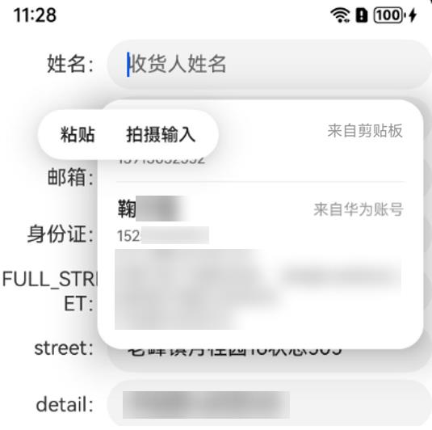

# 剪贴板粘贴框遮挡智能填充选择框

****现象描述****



****解决措施****

在代码文件中设置.selectionMenuHidden(true)，使剪贴板粘贴框隐藏。

```
      Row() {
        Text('收货人：').textAlign(TextAlign.End).width('25%')
        TextInput().width('75%').contentType(ContentType.PERSON_FULL_NAME).selectionMenuHidden(true)
      }
```
