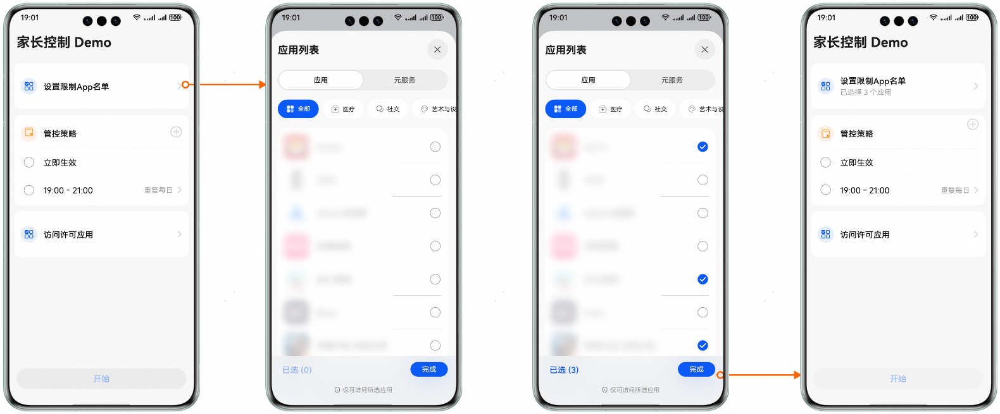
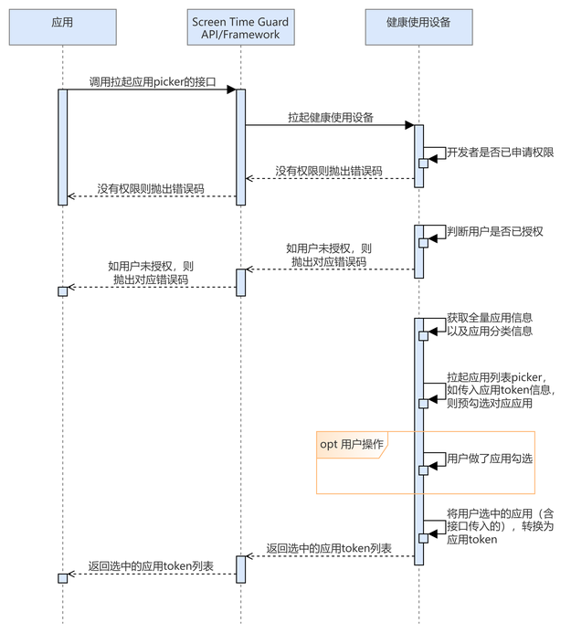

# 拉起应用选择页

## 场景介绍

在用户需要为特定应用设置使用时长或使用限制策略的场景下，开发者通过调用拉起应用选择页的接口拉起选择页后，使得用户能够选择目标应用。在用户选择完毕并点击完成按钮后，接口会返回应用的token。开发者获取到目标应用的token后，可以根据token为选定应用配置管控策略。

## 用户体验设计



## 业务流程



流程说明：

1. 应用调用拉起应用选择页的接口，拉起健康使用设备查询开发者是否已申请权限，以及用户是否授权。
2. 若状态为未授权，则抛出对应错误码；若状态为已授权，应用将拉起应用选择列表，并根据传入应用token信息预勾选对应应用。
3. 应用选择页将用户选中的应用列表转化为token列表返回给调用接口的应用。

## 接口说明

拉起应用选择页关键接口如下表所示：

| 接口名 | 描述 |
| --- | --- |
| [startAppPicker](/ref/screen-time-guard-api/screentimeguard-arkts/screentimeguard-app-picker/screentimeguard-app-picker#startapppicker)(context: [common.Context](/ref/ability-api/ability-arkts/ability-api-interface-depend/ability-arkts-application/js-apis-inner-application-context/js-apis-inner-application-context), appSelection: [guardService.AppInfo](/ref/screen-time-guard-api/screentimeguard-arkts/screentimeguard-guardservice/screentimeguard-guardservice#appinfo)): Promise&lt;string[]&gt; | 拉起应用选择页。 |

 

1. 应用选择页面中的应用列表不包含的系统应用包括：电话、联系人、设置、未成年模式等。
2. 应用选择页面中的应用列表不包含管控发起应用本身和已授权的管控应用。

## 开发前提

拉起应用选择页需要申请用户授权，请先参考[请求用户授权](/screen-time-guard-kit-guide/screentimeguard-interface-call-auth/screentimeguard-request-user-auth)章节完成用户授权。

## 开发步骤

1. 导入相关模块。

   ```
   import { appPicker } from '@kit.ScreenTimeGuardKit';
   import { hilog } from '@kit.PerformanceAnalysisKit';
   import { BusinessError } from '@kit.BasicServicesKit';
   ```
2. 调用startAppPicker，拉起应用选择页。

   ```
   @Entry
   @Component
   struct TestPage {
      build() {
         Column() {
            Button("TestStartAppPicker")
               .onClick(async () => {
                  try {
                     await appPicker.startAppPicker(this.getUIContext().getHostContext(), { appTokens: [] });
                  } catch (err) {
                     const message = (err as BusinessError).message;
                     const code = (err as BusinessError).code;
                     hilog.error(0x0000, `ScreenTimeGuard:startAppPicker`, `startAppPicker failed error code: ${code}, message: ${message}`);
                  }
               })
         }
      }
   }
   ```
