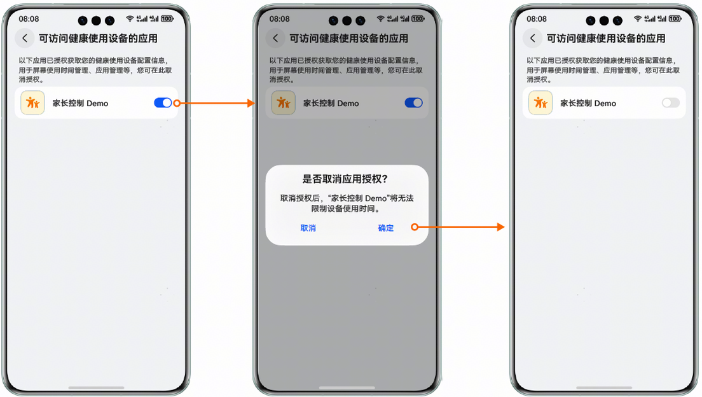
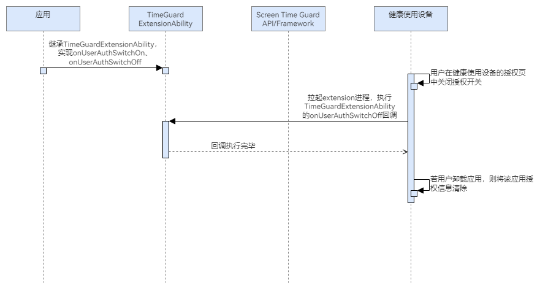

# 健康使用设备授权列表页中应用授权开关打开/关闭时触发回调

## 场景介绍

当通过健康使用设备授权列表页中的授权开关开启或者关闭应用授权时（设置-健康使用设备-右上角四点设置-可访问健康使用设备的应用），会执行TimeGuardExtensionAbility中的onUserAuthSwitchOn/onUserAuthSwitchOff回调方法，支持开发者在用户授予授权和撤销授权时执行特定逻辑。若之前已设置过健康使用设备的密码，则在此页面取消应用授权时需要输入健康使用设备的密码。

 

应用调用Screen Time Guard Kit接口获取授权或者取消授权时，不会触发onUserAuthSwitchOn/onUserAuthSwitchOff回调方法。只有在健康使用设备授权列表页操作授权开关时才会触发。



## 业务流程



流程说明（以关闭授权开关为例）：

1. 应用继承TimeGuardExtensionAbility，实现onUserAuthSwitchOn、onUserAuthSwitchOff方法，以监听用户授权状态。
2. 用户在健康使用设备的授权列表页中关闭授权开关后会拉起extension进程，执行TimeGuardExtensionAbility的onUserAuthSwitchOff回调。
3. onUserAuthSwitchOff回调执行，应用可以在该回调中可以执行特定逻辑。

## 接口说明

授权开关打开/关闭时的回调关键接口如下表所示：

| 接口名 | 描述 |
| --- | --- |
| [onUserAuthSwitchOn](/ref/screen-time-guard-api/screentimeguard-arkts/screentimeguard-timeguardextensionability/screentimeguard-timeguardextensionability#onuserauthswitchon)(): Promise&lt;void&gt; | 当用户授予授权时执行特定逻辑。 |
| [onUserAuthSwitchOff](/ref/screen-time-guard-api/screentimeguard-arkts/screentimeguard-timeguardextensionability/screentimeguard-timeguardextensionability#onuserauthswitchoff)(): Promise&lt;void&gt; | 当用户撤销授权时执行特定逻辑。 |

 

1. TimeGuardExtensionAbility与应用运行在不同进程，但共用沙箱。
2. TimeGuardExtensionAbility与应用直接无法直接传递数据，如需传递数据可以通过[用户首选项](/ref/arkdata-api/arkdata-arkts/js-apis-data-preferences/js-apis-data-preferences)/[数据库](/ref/arkdata-api/arkdata-arkts/js-apis-data-relationalstore/js-apis-data-relationalstore)等数据持久化手段进行传递，或者通过[公共事件模块](/ref/system-basicfun-api/basic-services-api/basic-services-arkts/process-thread-communi-arkts/js-apis-commoneventmanager/js-apis-commoneventmanager)传递。

## 开发步骤

1. 导入相关模块。

   ```
   import { TimeGuardExtensionAbility } from '@kit.ScreenTimeGuardKit';
   import { hilog } from '@kit.PerformanceAnalysisKit';
   ```
2. 继承TimeGuardExtensionAbility，重写onUserAuthSwitchOn和onUserAuthSwitchOff 回调。

   ```
   export default class EntryAbility extends TimeGuardExtensionAbility {
      async onUserAuthSwitchOn(): Promise<void> {
         hilog.info(0x0000, 'EntryAbility', 'test --- onUserAuthSwitchOn');
      }

      async onUserAuthSwitchOff(): Promise<void> {
         hilog.info(0x0000, 'EntryAbility', 'test --- onUserAuthSwitchOff');
      }
   }
   ```
3. 在工程中entry模块的module.json5文件中的"extensionAbilities"节点添加如下代码。

   ```
   "extensionAbilities": [{
      "name": "EntryAbility",
      "type": "screenTimeGuard",
      "srcEntry": "./ets/entryability/EntryAbility.ets",
      "exported": false,
      "skills": [{
      "actions": ["action.ohos.timeGuard.listener"]
      }]
   }],
   ```
