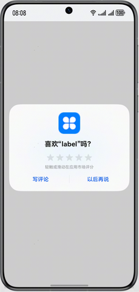
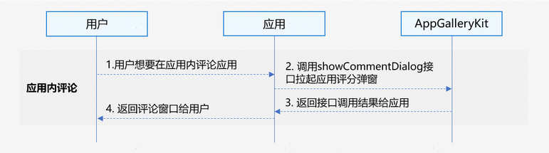

# 应用评论服务

通过应用评论服务，用户无需进入应用市场应用详情页，可以直接在应用内进行评论。

 

从版本6.0.0(20)开始，支持拉起应用评论弹框。

## 场景介绍

- 拉起应用评论弹框

  开发者可以通过该接口拉起应用评论弹窗对应用进行评分及评论，无需进入应用市场应用详情页进行评论。



## 业务流程



1. 用户需要在应用内评论应用。
2. 应用调用showCommentDialog接口拉起应用评论弹窗。
3. AppGalleryKit返回接口调用结果给应用。
4. 应用返回评论窗口给用户。

## 约束与限制

应用评论服务不支持模拟器，请使用真机调试。

## 接口说明

应用评论服务提供以下接口，具体API说明详见[接口文档](/ref/store-api/store-arkts/appgallery-commentmanager/appgallery-commentmanager)。

| 接口名 | 描述 |
| --- | --- |
| [showCommentDialog](/ref/store-api/store-arkts/appgallery-commentmanager/appgallery-commentmanager#commentmanagershowcommentdialog)(context: common.UIExtensionContext | common.UIAbilityContext): Promise&lt;void&gt; | 拉起应用评论弹窗，用户可以在应用内评论应用。 |

## 开发步骤

1. 导入commentManager模块及相关公共模块。

   ```
   import { commentManager} from '@kit.AppGalleryKit';
   import { hilog } from '@kit.PerformanceAnalysisKit';
   import { BusinessError } from '@kit.BasicServicesKit';
   import type { common } from '@kit.AbilityKit';
   ```
2. 调用[showCommentDialog](/ref/store-api/store-arkts/appgallery-commentmanager/appgallery-commentmanager#commentmanagershowcommentdialog)方法拉起评论弹窗。

   ```
   try {
     const uiContext = this.getUIContext().getHostContext() as common.UIAbilityContext;
     commentManager.showCommentDialog(uiContext).then(()=>{
       hilog.info(0, 'TAG', "succeeded in showing commentDialog.");
     }).catch((error: BusinessError<Object>) => {
       hilog.error(0, 'TAG', `showCommentDialog failed, Code: ${error.code}, message: ${error.message}`);
     });
   } catch (error) {
     hilog.error(0, 'TAG', `showCommentDialog failed, Code: ${error.code}, message: ${error.message}`);
   }
   ```
