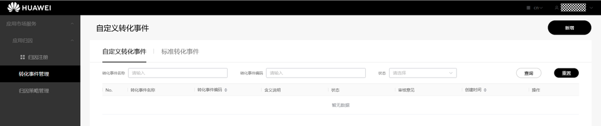
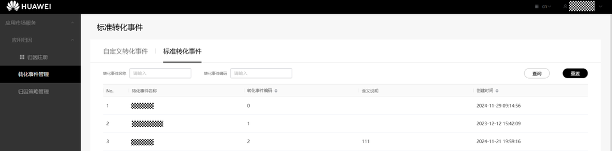

# 标准转化事件

接入应用归因服务前，请先明确转化事件。应用归因支持标准转化事件和自定义转化事件，建议开发者优先选用标准转化事件登记上报。若无法满足业务需求，开发者可自行创建[自定义转化事件](/store-kit-guide/store-attribution/store-attribution-preparations/store-attribution-trigger/store-attribution-trigger-custom)用于后续的归因服务。

****处于生效状态的开发者角色的合作伙伴在转化事件管理页面可以查看标准转化事件和自定义转化事件：****

点击左侧“转化事件管理”菜单，点击页面中“标准转化事件”。

查看[标准转化事件信息](/store-kit-guide/store-attribution-appendix/appgallery-attribution-appendix-triger#标准转化事件信息)。

 

生效状态的监测平台角色只展示标准转化事件列表。
