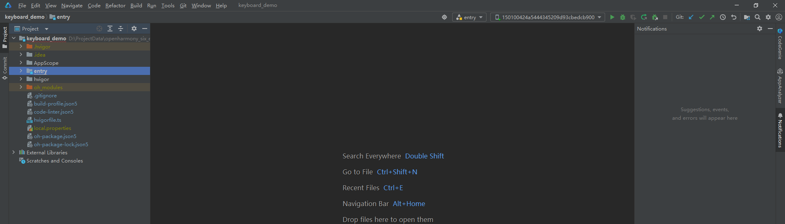

# 环境准备

## 开发工具及配置

DevEco Studio作为驱动开发工具，是进行驱动开发的必备条件之一，我们可以使用该工具进行开发、调试、打包等操作。请下载安装该工具，并参考工具概述中的创建一个新的工程进行基本的操作验证，保证DevEco Studio可正常运行。

请使用[华为账号-登录](https://developer.huawei.com/consumer/cn/download/)下载安装该工具，并参考[工具概述](/ide-tools-overview)中的[创建一个新的工程](/ide-project/ide-create-new-project)进行基本的操作验证，保证DevEco Studio可正常运行。

## SDK版本配置

扩展外设管理模块提供的ArkTS接口，所需SDK版本为API10及以上版本才可使用。

基于DDK能力开发专业专用扩展外设驱动或扩展外设增强驱动时，对SDK版本的要求如下：

| NDK接口 | SDK版本 |
| --- | --- |
| [UsbDdk](/ref/system-hardware-api/driver-development-api/driver-development-c/driver-development-module/capi-usbddk/capi-usbddk) | API10及以上 |
| [HidDdk](/ref/system-hardware-api/driver-development-api/driver-development-c/driver-development-module/capi-hidddk/capi-hidddk) | API11及以上 |
| [USBSerialDDK](/ref/system-hardware-api/driver-development-api/driver-development-c/driver-development-module/capi-serialddk/capi-serialddk) | API18及以上 |
| [ScsiPeripheralDDK](/ref/system-hardware-api/driver-development-api/driver-development-c/driver-development-module/capi-scsiperipheralddk/capi-scsiperipheralddk) | API18及以上 |

## 检验环境是否搭建成功

检查DevEco Studio是否已连接上HarmonyOS设备。

## HDC配置

HDC（HarmonyOS Device Connector）是为开发人员提供的用于调试的命令行工具，通过该工具可以在Windows/Linux/Mac系统上与真实设备或者模拟器进行交互，详细参考[hdc](/system-debug-optimize/debugging-commands/hdc)配置。

 

“配置环境变量hdc\_server\_port”和“全局环境变量”为必须操作。

## 开发设备

- 当前开发调试及验证，以PC作为开发设备进行说明。
- 开发扩展外设驱动客户端和扩展外设驱动时，需要一个外接USB设备进行调试，****当前仅支持通过USB总线连接的外接设备****。
- 需要知道外接USB设备的ProductId和VendorId，用于定义驱动以及IPC通信。
