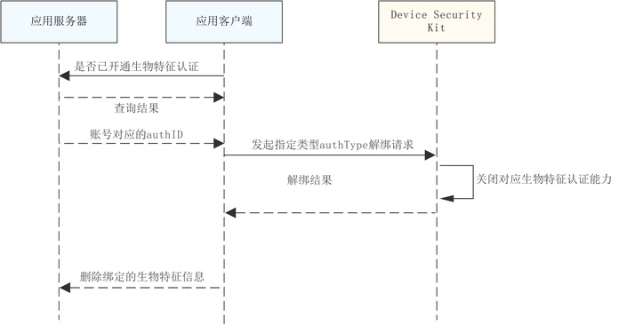

# 关闭指定生物类型认证能力

## 场景介绍

当用户期望关闭指定生物特征认证能力时，可以通过指定已开通的生物特征信息，关闭指定的生物类型认证能力。

## 约束与限制

本功能目前仅在手机设备支持，且需应用服务器端同步接入配合端云协同认证。

## 业务流程



## 接口说明

接口及使用方法请参见[API参考](/ref/system-security-api/device-security-api/devicesecurity-arktsapi/devicesecurity-arktsapi-errcode/devicesecurity-arktsapi-errcode-trusted-auth/devicesecurity-arktsapi-errcode-trusted-auth)。

| 接口名 | 描述 |
| --- | --- |
| [disableTrustedBioAuthentication](/ref/system-security-api/device-security-api/devicesecurity-arktsapi/devicesecurity-trusted-auth-api/devicesecurity-trusted-auth-api#disabletrustedbioauthentication)(authID: bigint, authType: [AuthType](/ref/system-security-api/device-security-api/devicesecurity-arktsapi/devicesecurity-trusted-auth-api/devicesecurity-trusted-auth-api#authtype)): Promise&lt;void&gt; | 解绑指定生物类型认证能力 |

## 开发步骤

1. 导入trustedAuthentication 和相关依赖模块。

   ```
   import { trustedAuthentication} from '@kit.DeviceSecurityKit';
   import { BusinessError} from '@kit.BasicServicesKit';
   import { hilog } from '@kit.PerformanceAnalysisKit';
   ```
2. 首先开发者需要在服务器查询对应账户是否已开通对应生物特征认证能力，在确认开通后方可发起解绑指定生物类型认证能力请求。
3. 发起关闭指定生物类型认证能力请求前，需从服务器获取当前账号在[设置数字盾密码](/system-security/device-security-kit-guide/devicesecurity-trustedauth-service/devicesecurity-trustedauth-pwdmng/devicesecurity-trustedauth-setpwd)时获取的authID。
4. 调用数字盾解绑指定生物类型认证能力接口发起关闭对应生物类型认证能力申请。

   ```
   const TAG = "TrustedAuthenticationJsTest";
   try {
    const authID: bigint = 1687413472599354502n;//实际填充为从服务器获取到的账号对应的authID值
    const authType = trustedAuthentication.AuthType.AUTH_TYPE_FACE; //实际填充为计划解绑的生物特征类型
    const remainTimes = await trustedAuthentication.disableTrustedBioAuthentication(authID, authType);
   } catch (err) {
     let e: BusinessError = err as BusinessError;
     hilog.error(0x0000, TAG, 'disableTrustedBioAuthentication: %{public}d %{public}s', e.code, e.message);
   }
   ```
5. 在接收到端侧解绑成功结果后，开发者需要同步将服务器绑定的生物特征信息解绑。
