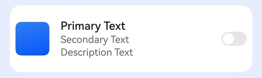

# 设置列表卡片样式

## 场景介绍

从6.0.0(20) Beta1版本开始，新增支持设置列表卡片样式。

应用使用[HdsListItemCard](/ref/ui-design-api/ui-design-arkts-component/ui-design-hdslistitemcard/ui-design-hdslistitemcard)组件实现多设备上的系统列表样式。



## 开发步骤

1. 导入相关模块。

   ```
   import { HdsListItemCard, PrefixImage, SuffixSwitch} from '@kit.UIDesignKit';
   import { promptAction } from '@kit.ArkUI';
   ```
2. 创建HdsListItemCard组件，设置左边为Image，中间为Text，右边为Switch的场景。

   ```
   @Entry
   @Component
   struct Test {
     private scroller: ListScroller = new ListScroller();

     build() {
       Column() {
         List({ space: 10, scroller: this.scroller }) {
           ListItem() {
             HdsListItemCard({
               // A区图片
               prefixItem: new PrefixImage({
                 image: $r('app.media.background'),
                 onClick: () => {
                   promptAction.openToast({ message: 'left image' });
                 }
               }),
               // B区文本
               textItem: {
                 primaryText: {
                   text: 'Primary Text'
                 },
                 secondaryText: {
                   text: 'Secondary Text'
                 },
                 description: {
                   text: 'Description Text'
                 }
               },
               // C区Switch
               suffixItem: new SuffixSwitch({
                 isCheck: false,
                 onChange: (num: boolean) => {
                   if (num) {
                     promptAction.openToast({ message: 'switch is true' });
                   } else {
                     promptAction.openToast({ message: 'switch is false' });
                   }
                 }
               }),
               onClick: () => {
                 promptAction.openToast({ message: 'hdslistitem' });
               }
             })
           }
         }
         .width('100%')
         .height('100%')
         .margin(10)
       }.backgroundColor(0x1a0a59f7).height('100%')
     }
   }
   ```
