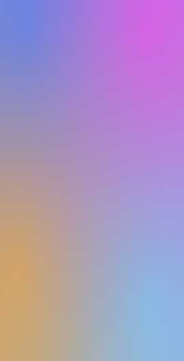

# 背景流光

## 场景介绍

从6.0.0(20) Beta1版本开始，新增支持[背景流光](/ref/ui-design-api/ui-design-arkts/ui-design-hdseffect/ui-design-hdseffect#effecttype)。

通过背景流光接口可以设置组件的背景流动发光效果，并且可以设置背景色及渐变背景色，常用于全屏幕背景流光等。

## 开发步骤

1. 导入模块。

   ```
   import { hdsEffect } from '@kit.UIDesignKit';
   ```
2. 设置背景流光效果。

   ```
   @Entry
   @Component
   struct UVFlowLight {
     @State controller: hdsEffect.ShaderEffectController = new hdsEffect.ShaderEffectController();

     build() {
       Stack() {
       }
       .visualEffect(new hdsEffect.HdsEffectBuilder()
         .shaderEffect({
           effectType: hdsEffect.EffectType.UV_BACKGROUND_FLOW_LIGHT,
           animation: {
             duration: 10000,
             iterations: -1,
             autoPlay: true,
             onFinish: ()=> {
               console.info('Succeeded in finishing');
             }
           },
           controller: this.controller,
         })
         .buildEffect())
       .width('100%')
       .height('100%')
     }
   }
   ```

   
